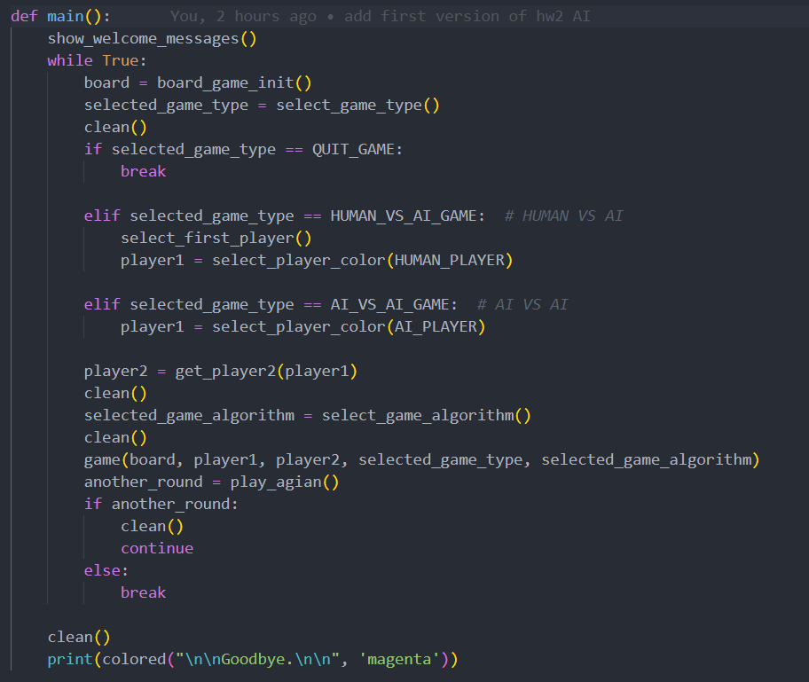
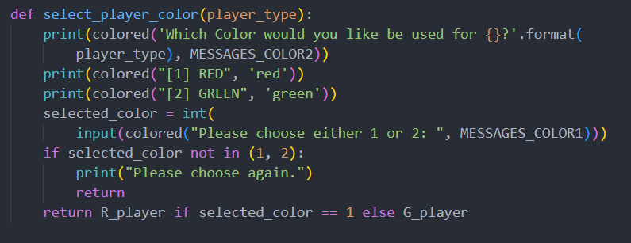
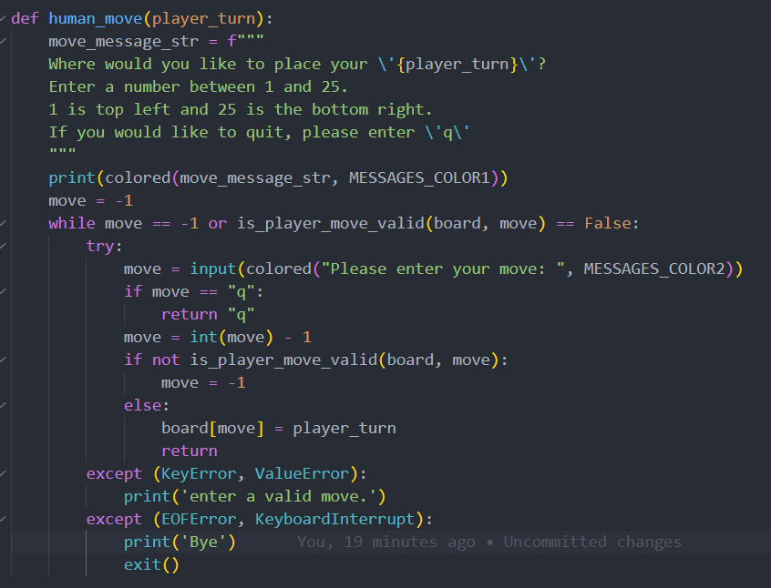

## Adversarial Search: Tic Tac Toe in Python Using The Minimax Algorithm
### Project Description
- Familiarity with adversarial search
- Consider a game that has a five by five board.
- Two players play against each other. One player has a red piece (R) and the other player has a green piece (G).
- The players place their pieces in the cells of this page in order.
- Whenever three pieces of a player are placed in a row (row, column or diagonal), that player wins.
- We wrote a program in Python to play this game using the MiniMax algorithm.
- The program is done in two ways:
    1. a computer plays with a user.
    2. or the computer plays against itself.

- What method to use or which player and what color to play with **is asked first**.
- By default, the game is played against one user and the first computer plays with the green piece.
- We also implemented the program using alpha-beta pruning.
- In this program, a depth of 5 is used for the minimax algorithm and a depth of 8 is used for the minimax pruned algorithm, and these numbers were obtained experimentally (greater depths would take much more time to calculate the answer).

**HOW TO RUN THE PROGRAM?**
- go to the codes folder and run the below command in your terminal=)
``` bash
python main.py
```
### Implementation Details
- I used the below algorithm for implementing this program
- 
-  

#### minimax function
- 
- It is assumed that the first player or player1 is the max player 
- The second player is the min player who wants to minimize the profit.
- If we reach the zero depth or the game reaches the final answer and the game over is declared, it means we are in the tree's leaves and the value of the terminals must be calculated. 
- For this, an evaluation function is used.
- In a loop with the number of repetitions 25 (because the game board is 5x5), we start building a tree.
- We only have to consider states of the board where the house is empty, so we check whether that house is empty.
- We temporarily place the value of the player's piece in that house and **check the best value** that is created from the children of that state, that is, we have to call the function again, but this time we check for the opponent of the current player.
- If the current player has the green piece, call the player with the red piece.
- The minimax function returns two values. 
- One is the best action and the other is the best score for that player
- Here we need the best score, so we need to update the best score for each player depending on whether it is Max or Min.
- We also consider the best action as the loop index, which is i.
- Finally, these two values are returned to be used for higher nodes.


#### evaluate function
- 
- Because the first player is Max, it gets 1 point and the second player, who is Min, is given -1 and otherwise 0.

#### check_win function
- 
- The function checks the different states in the tree to determine if the game reaches an answer.
- The modes in which we get an answer for the game are as follows:
- One of the players wins.
    1. The winning player has placed 3 pieces in 3 consecutive houses in a row.
    2. The winning player has placed his 3 pieces in 3 consecutive houses in one column.
    3. The winning player has placed his 3 pieces in 3 consecutive houses in the main diagonal (from left to right).
    4. The winning player has placed his 3 pieces in 3 consecutive houses in the sub-diagonal (from right to left).
- Both players draw.

#### is_game_over function
- 
- The function checks whether the game has reached the end or not.

#### minimax_ab function
- The alpha beta minimax 

- 

- The difference between this algorithm and Minimax is in the use of an alpha and a beta, which is used for the max player and beta for the min player.

#### main function
- 
- In the main loop of the game, which will not be exited until the q button is pressed, we must specify the following information:
1. Type of game (1.Human game against computer 2.Computer game against computer)
2. If game type 1 is selected, it must be determined whether the first player is a human or a computer
3. Each player chooses which piece or color he wants to play with (between green and red)
4. Choosing the type of algorithm to run the game (1.Minimax 2.minimax using alpha beta pruning)
- With this information, we enter the game function where the game is played.
- At the end of this main function, the user is asked whether he wants to play the game again or not. 
- If he has, he can enter all the above information and play again, otherwise he will be out of the game.

- in the main function, the below steps will be executed.
    - 
    - 
    - 
    - 
    - 

#### human_move function
- 
- In this function, we take the desired movement of the user from the input and check that this movement is valid, that is, the is_player_move_valid function is called and until the user enters the appropriate number, the message of entering the appropriate number is shown to him.
- The appropriate number is from 1 to 25.
- If the user enters the character 'q' at the input, he will exit the game.

#### is_player_move_valid function
- 

#### ai_move function
- 
- In this function, the computer (AI) uses appropriate algorithms to find the best solution depending on the type of algorithm entered.
- Since the space of our game state has 25 states, we need to determine a depth because the tree with 25 states in its space becomes very large and cannot be checked.
- As we know, the minimax pruned algorithm works much better than the minimax algorithm. 
- To prove it, a variable called **num_repeat_algorithm** is defined, and whenever we use an algorithm, one is added to this variable. 
- By getting closer to the answer and decreasing the depth and climbing up the tree (since we are working recursively, it starts from the end of the tree), the number shown by this variable decreases because fewer numbers are checked.
- By comparing the value of this variable in the minimax pruned algorithm with minimax itself, we realize that it is faster and more efficient.
- If we want to compare in terms of time, the time it takes for the pruned algorithm to find the answer is much less.

#### game function
- 
- In this function, the main body of the game is executed.
- As long as the game is not over (game over), it is one player's turn in the loop.
- Depending on the type of game, the appropriate move is made. 
- If the game is human versus computer, it is checked whether the first move is for human or not.
- If the game is of the second type, the ai_move function is called every time and depending on the selected algorithm, the best move for computers is selected.
- At the end, the turn of the game changes and if it was the turn of the first player, the turn of the second player is given, and so on for the other.
- If the game ends, we will leave this loop.
- If we have a winner, a message will be printed indicating which player is the winner.

### The Game Execution
1. select type of the game
- 

2. select the first player
- 

3. select the color to play with
- 

4. select the algorithm of play
- 

5. display of the game board
- 

6. Show the player who has to make a decision or is making a decision.
- Display the number of algorithm calls.
- 

7. display the winner
- 
- At the end, the user can choose to play again or not.

## License
- This project is licensed under [MIT License].
- You can use it for personal or educational purposes as long as you give credit to its author.

## Author
- This project was created by Hadis Ghafouri as the project of the AI course at IUT.
- You can contact me by email at hadisghafouri98@gmail.com.
- hope you enjoyed it =))