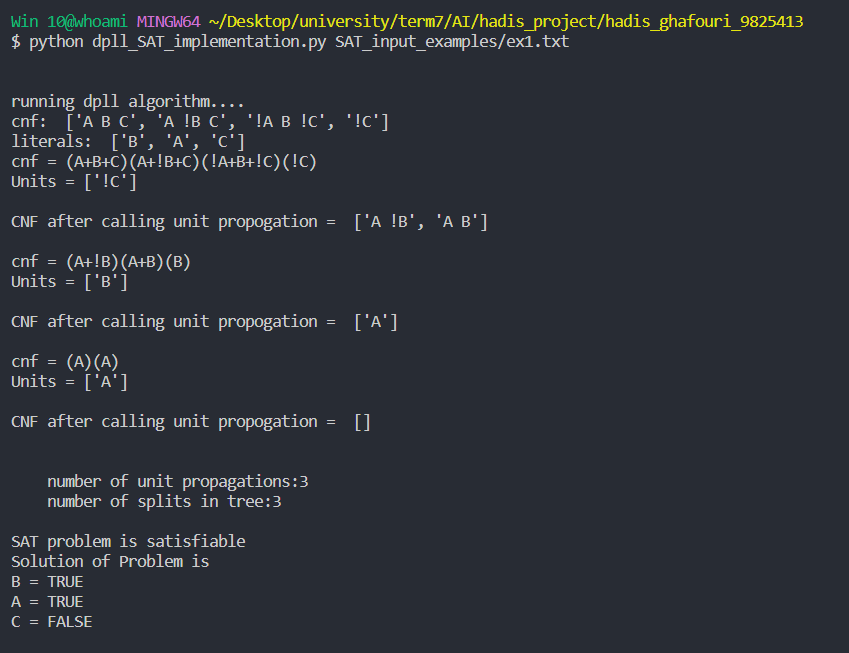

## The Implementation of Davis–Putnam–Logemann–Loveland (DPLL) Algorithm

### What is it used for?
- DPLL algorithm is mostly used to understand if a logical proposition is unsatisfiable or not.
- DPLL algorithm makes our calculations a lot faster, with helping us reduce the total number of cases we need to check.
- With DPLL algorithm, we try to check the most likely model for the proposition via setting some propositions true or false. 
- If we see that, the proposition is still not possible to satisfy even in that case; we conclude that this proposition is unsatisfiable.

### How does it work?
- Our proposition should be in “Conjunctive Normal Form”
- Before starting, we need to make sure that the proposition we have in hand is in Conjunctive Normal Form(CNF).
- It actually means a proposition filled with ∧ and ∨.
- So, basically you shouldn’t have any arrows. 
- Your sub-clauses that are separated by parenthesis, should be separated by ∧ , not ∨. 
- ex1 which is in CNF form
- 
- ex2 which is not in CNF form
- 
- ex3 which is not in CNF form
- 

- To achieve this, you should apply the following steps:

- Replace (a ⇔ b) with (a ⇒ b) ∧ (b ⇒ a)
- Replace (a ⇒ b) with (~a ∨ b)
- Move negations inside e.g. :
    - ~(~a) = a
    - ~(a ∧ b) = ~a ∨ ~b
    - ~(a ∨ b) = ~a ∧ ~b
- Distribute ∨ over ∧:
    - a ∨ (b ∧ c) = (a ∨ b) ∧ (b ∨ c)

### DPLL Algorithm Methods to Apply
#### Unit-clause Heuristic
- This basically means that if there is any letter standing alone in your Conjunctive Normal form, you should set it to true. 
Let’s see it again on Figure1.
- 
- For this proposition to be true, every sub-clause separated by ∧ should be true.
- Since ~A is standing alone, it should set true by setting A as false.
- Here we should set A = false.

#### Pure Symbol Heuristic
- The letter that occurs only in the positive or negative format through the whole proposition. 
- In the below example, we see that A and B both occurs in positive and negative forms ( A, ~A, B, ~B). 
- However C is only in positive form.
- 
- In these cases if pure symbol always occurs positive, it should be set true;
- if it always occurs negative, it should be set false.
- Here we would need to set C = true.

#### Early Termination
- If all sub-clauses that separated by ∧ are true; then the proposition is satisfiable.
- If all sub-clauses are false, then the proposition is unsatisfiable.

### Explanation of the algorithm
- 
- This algorithm is complete and works based on backtracking logic.
- In this algorithm, an input in CNF format is used and the DPLL solution function is called recursively.
- We call a clause a single clause that consists of a symbol or a combination of symbols and !.
- As long as we have a single clause, we can remove it from the rest of the input clauses.
- If the detected clause is exactly repeated in another clause, we delete that clause in general, and if the opposite of that symbol is repeated in another clause, we delete only the same symbol.
- We call this operation unit propagation.
- After this operation, we have to do two checks.
1. If we have a clause that is null, we must return False in the output, which means that we cannot satisfy the problem with this initialization.
2. If the input CNF, which we keep updating, eventually becomes empty, that means all the clauses are correctly set and satisfied, then we return True.
- Otherwise, we have to create new branches of the tree and assign a value to a new variable or literal.
- so we have to select a symbol from the list of existing symbols and add an entry to the entire CNF and first see if we will get to CONFLICT by setting it to TRUE or not?
- If we reach a conflict, we must BACKTRACK and instead of TRUE, we must consider FALSE for that variable, and with this initialization, we must check the satisfaction of the variables again.
- Every time we reach a CONFLICT, i.e. we reach a value that violates the satisfiability of the variables, we must go back and climb the branch of the tree and check another value.

### Implement Details
#### Program input format
- The input should be in the following format and in a file.
- Since our format is CNF, we should put a CLAUSE in each line of the file.
- Each of these CLAUSEs contains one or more LITERALs that are ORed together and finally these CLAUSES are ANDed together.
- 
- the function to read the input file:
- 
- In this function, we get the name of the file from which we want to read CNF.
- with the help of the splitlines function, we convert the file into the lines it has and save it in an array called cnf.
- So the cnf variable contains a list of input clauses.
- We get the list of symbols using the get_alphabet_literals function and save it in the literals variable.
- and finally print these values and return them as the output of the function.

#### run_dpll_algorithm function
1. Reading input file and saving cnf, literals
2. Implementation of dpll algorithm
3. Print the results (satisfactory or unsatisfactory)
- 

#### get_alphabet_literals function
- 
- In this function, we take cnf as input and use a for loop to identify the symbols.
- With the help of the isalpha function, we check that the selected symbol is among the letters of the alphabet.
- Finally, we return the list of symbols.

#### print_CNF_form function
- 
- Since cnf is not clearly present in the input file, we use this function when we want to see its exact form.
- In each clause, we display the + sign between the literals and the whole clause in parentheses.
- if cnf is null or empty, we display an empty parenthesis.

#### print_result function
- 
- In this function, based on is_satisfiable boolean, we decide how to print the output.
- In the program, we have two global variables named num_propagations and num_splits.
- the first one shows how many times the unit propagation operation is performed
- and the second one shows how many times we go down the tree and two new branches are created.
- In this function, these values are printed, and if the problem is satisfactory, the assigned values are printed, and if not, we say that it is not satisfactory.

#### dpll_solve function
- 
- In this function, for each call, we go down one level in the tree, so the value of num_splits is increased by one.
- In each step, we write the value of the cnf variable as described in the function above.
- For each of the true and false values, we have two variables named temp_true_set and temp_false_set, which are temporary values at each stage of the tree that we assign to the variables.
- If we encounter a conflict, we delete the values in this array from the main array of true and false values.
- We have two sets named true_value_set and false_value_set.
- the reason for choosing the set is the non-repetition of the existing values.
- In these variables, which are updated at each stage, we put the values assigned to the symbols or variables of the problem.
- To find the units, we use the function find_units() and we must perform unit propagation for each unit.
- So, for each unit, a value is added to the number of num_propagations.
- Because we are temporarily assigning values, we store them in the said Temp arrays.
- Here, if we have a positive literal, we call the function handle_unit_propagation_true(cnf, unit) 
- if we have a negative literal, we call the function handle_unit_propagation_false(cnf, unit).
- Finally, after completing this operation, we must print the updated cnf.

- 
- Next, if the length of the cnf variable, which is an array, is zero, it means that it does not have any other members, and that means it is null.
- So we return the True value, which means that the assignment is satisfactory.
- If we find a null clause, we must backtrack and delete the assigned value and assign a new value, so we return False.
- Otherwise, we select a new literal and assign the true and false values to it separately and check each one.
- If one of them is true, then we continue. 
- If none of them is true, we have to go up one level in the tree and flip the parent variable that caused the creation of these two children, that is, if it is true, we make it false, and if it is false, we make it true.

#### handle_unit_propagation_true function
- 

- The sets false_value_set, true_value_set are defined globally, so we must use the word global in this function.
- We get the literal symbol or alphabet with the help of unit[-1] which extracts the last member of the presentation and add this value to the false_value_set set (it will be removed if it causes a conflict in the future)
- For all the existing clauses, in case of question, we should check each one of them whether they have this symbol or its opposite or not.
- If they had the contradiction that the whole clause will be removed because we considered the symbol contradiction correct and because we know that the or operator is located between the literals in a clause, then the whole clause will be corrected.
- After that, we use remove() and remove it from cnf and decrease the value of the counter by one because the number of clauses decreased by one.
- If there is exactly the symbol itself without a reversed sign, we should only delete that symbol and the rest of the literals in the clause will remain intact.
- So we replace that symbol with "" that is, with a null string so that it is deleted.
- Finally, when the index in this circle exceeds the number of clauses, we leave the loop.

#### handle_unit_propagation_false function
- 

- This function is similar to the above function with the difference that it works for correct values
- If there is a not sign next to a symbol in a clause, only that symbol and its not are removed
- If the ! sign is not there and the symbol is alone (positive literal), all clauses containing this symbol will be deleted.

#### is_empty_clause function
- 
- In this function, if we have even one clause that is empty, we will return the correct value so that we can perform the backtrack operation.

#### handle_backtrack function
- 
- In this function, because we want to climb the tree, we have to delete the assigned values.
- so we delete all the values that are in the temp arrays from the original correct and incorrect sets.

### Execution Example
- 
- As you can see, this problem can be satisfied with the following values:
- A = TRUE
- B = TRUE
- C = FALSE

- 
- According to Ex2.txt file, the given problem is not satisfiable.

## References
[brief-explanation-of-dpll-davis-putnam-logemann-loveland-algorithm](https://mertozlutiras.medium.com/brief-explanation-of-dpll-davis-putnam-logemann-loveland-algorithm-663f4a603c1)

## License
- This project is licensed under [MIT License].
- You can use it for personal or educational purposes as long as you give credit to its author.

## Author
- This project was created by Hadis Ghafouri as the project of the AI course at IUT.
- You can contact me by email at hadisghafouri98@gmail.com.
- hope you enjoyed it =))