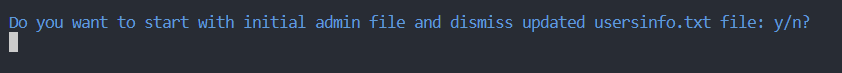
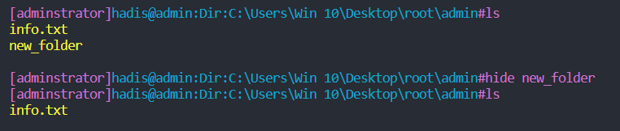
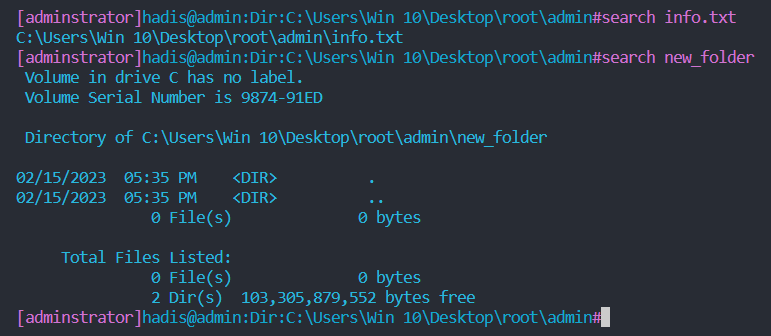

# C Linux Terminal Project

- 

### About Project

- The purpose of this project is to simulate a communication environment with users through command line.
- The created environment is similar to the terminal of the Linux operating system.
- we used a directory as the root of our hypothetical operating system.
- all commands will be executed in this directory.
- This simulator should receive a string from the user and execute that command.

## How To Run Program

#### go to "codes" folder and run below commands.

- 

## Project Sections
- This project has 2 main sections
    1. [User management](#user-management)
    2. [Files and Directory management](#files-and-directory-management)
- if a command is entered which is not recognized, our terminal will show an error!
    - 
### User management

- In this section of the simulator, user login and exit management, storage of necessary information and other required facilities are implemented.
- For each user, at least the fields of user name, username, password and password strength should be saved.
- The strength of the password is determined according to the following rule.
- On the right side of the table, the presence of any character with the right condition adds the said percentage to the strength of the password.
- Please note that this number cannot be more than 100%.

| Password components | password strength percentage |
| ------------------- | ---------------------------- |
| Small letter        | 2%                           |
| Capital letter      | 4%                           |
| digits              | 3%                           |
| punctuations        | 8%                           |
| space               | 1%                           |

- a deadline for working with the system
    - it means how long this user has the right to work with the system.
    - For example, if a user tries to enter the system after the specified date, the system will prevent her/him from entering.

- User access level (which can be 0 or 1.)
    - 0 means normal user.
    - 
    - 1 means system administrator.
    - 
    - the number of wrong commands (if a command is entered that is not among the commands introduced below, a number will be added) to be saved

- Considering the above structure for user storage, at the beginning of the simulator program, it should wait for the user to enter the username and password and allow entry if the input is correct.
    - 

- Otherwise, it should inform the user by displaying the appropriate message.

- After entering the simulator, it should always display the user name of the person who is inside the system.

- If the deadline for working with the system has expired for the user, the simulator should not allow entry.    
    - 

### implemented user commands

- **su**
  - This command is used to change the user (switch user).
  - 
  - by entering su username, the simulator should change the username to the user after checking the correctness of the password (the administrator does not need to enter the password to enter other accounts).
  - 
  - If the time of user has expired, it should not allow admin to use "su" command.
  - 

- **passwd**

  - This command is used to change the password.
  - the system administrator user (access level 1) can change the password of all users in such a way that she/he must enter the passwd command with the desired user's username.
  - The strength of the password in order to prevent intrusion: When setting the password for the user (creating a new user or changing the password), it must be more than 33%.
  - 

- **passwd -l time username**
  - By receiving the -l option and receiving the passwd command, the time limit for working with the user's system will be changed to the received time.
  - The -l option can only be executed by the system administrator.
  - 

- **create user**

  - It is done by the administrator.
  - It adds a new user and takes and saves the new user's information.
  - 

- **chgr username**
    - this command will upgrade the access level of specified user.
    - An administrator can turn a user named username into an administrator with the help of this command.
    - to convert a user, the following conditions must be met:
        - The user must be a normal user.
        - The acceptable level of the user's password should be more than 75%.
        - The number of wrong commands entered by the intended user should not exceed 10.
    - 
    - 

## Files and Directory management

- This set of commands will be responsible for creating and managing files and directories.
- In this simulator, the characteristics of each file are the file name, the file creator, and the last time the file was accessed.

### Implemented commands

- **cd**

  - This command changes the current location to a specific directory (𝑐𝑑 dirname).
  - if ".." is used instead of dirname, the current location will go to a previous directory.
  - Addresses can be both relative and absolute  

- **pwd**

  - This command displays the current location of the system and will show in which directory the simulator is now.
  - 

- **mkdir**
    - This command should be able to add a new directory.
    - 

- **Operator <**
    - For example, in the command Hello > filename, the phrase Hello must be written in the file filename.
    - if there is a file name instead of Hello, all the contents of that file will be written in the filename file.
    - First, it must be checked whether Hello is the name of a file in the current location or not. 
    - if not, the file must be created.

- **Operator <<**
    - This operator works exactly like <.
    - with the difference that this operator will continue to write the second file.
    - 
    - 
  

- **cat**
    - display the name of the file, the contents of that file.  

- **rm**
  - rm filename
  - This command deletes the file
  - 

- **rm -r**
    - To delete directories, the command rm -r must be used.
    - 

- **cp**
  - copy a file to another location.
  - 

- **mv**
    - This command will move a file to another location.
    - 

- \*Note: In the previous two commands, their addresses can be written instead of the names of the files.

- **ls**
    - displays the contents of the current directory (files and directories)
    - 
    

- **exif**

  - command displays information such as the creator of the file, the creation time and the last change made, the location, etc.
  - 

- **wc**
    - This command will display a report about the number of words and the number of lines of a file.
    - 

- **diff**

  - This command compares two files and displays a message.
  - 

- **hide**
    - it hides files in our directory
    - 

- **time**
    - it displays the time of the system.
    - 

- **time -a**
    - it displays the time of the system more specifically.
    - 

- **search**
    - it search a specific file in a folder.
    - 
- **hide -r**
    - it reverses the action of "hide" command.
    - 
- **help**
    - 
    - if an invalid number is entered, the program will display an error message.
    - 
## License

- This project is licensed under [MIT License].
- You can use it for personal or educational purposes as long as you give credit to its author.

## Author

- This project was created by Hadis Ghafouri as Final Project of Basic Programming course at IUT.
- You can contact me by email at hadisghafouri98@gmail.com.
