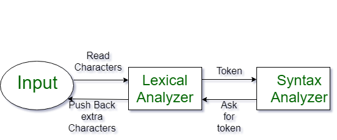
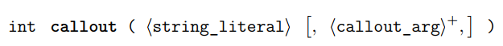
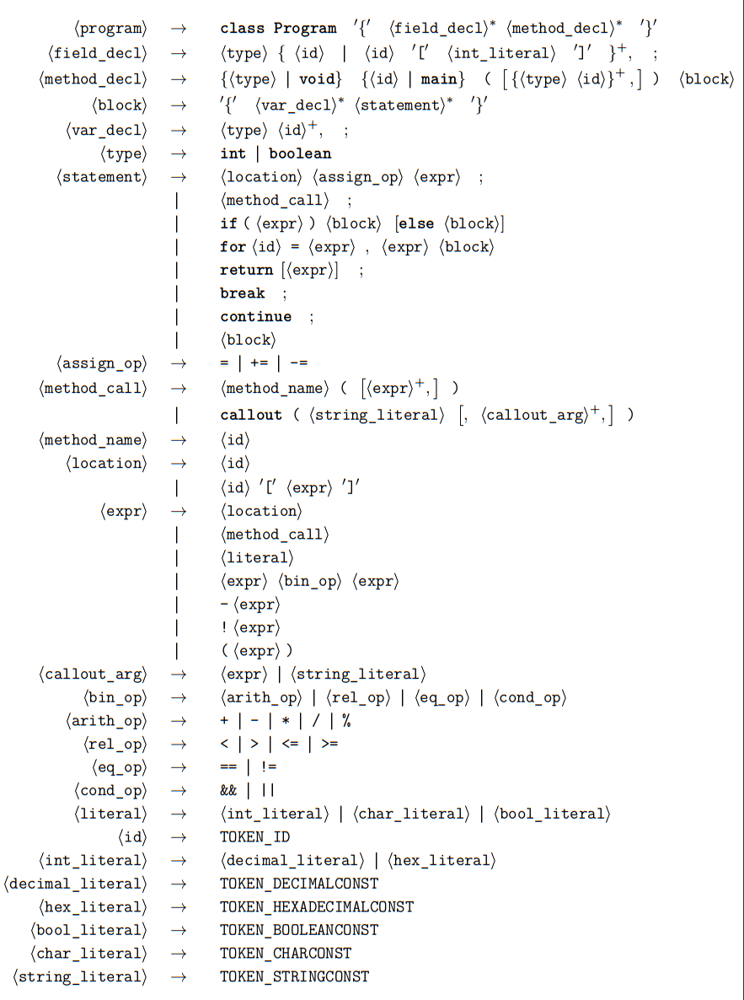
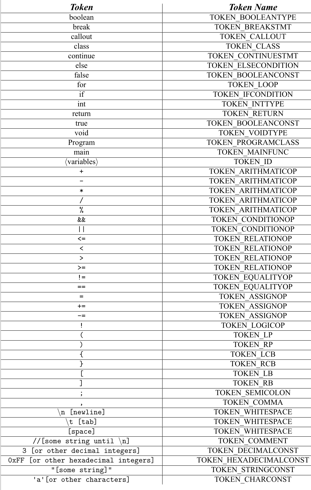
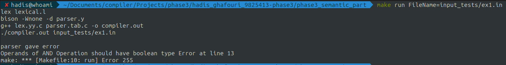
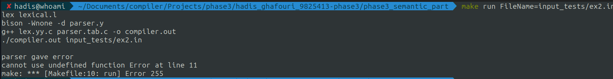
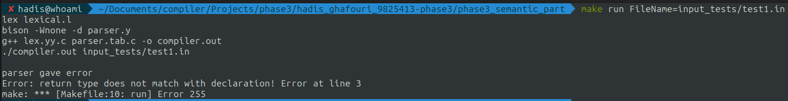
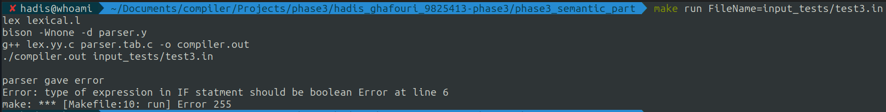
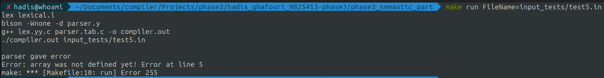
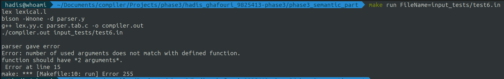

## Xlang Compiler Design & Implementation

- In this project, we plan to design and implement a compiler for a language called Xlang.
- Xlang is a simple programming language similar to C or Pascal.
- The implementation of this compiler is done using two tools, [Bison](https://www.gnu.org/software/bison/) and [Flex](https://manpages.ubuntu.com/manpages/focal/man1/lex.1.html).
- The target compiler must be able to receive a file containing code written in Xlang language and considering the three parts of lexical, syntactic, and semantic analysis and other necessary concepts that are in the compiler lesson, It produces an output code in assembly language
- The [phase1](#phase1-lexical-analyzer) contains the implementation of the lexical analyzer.
- The [phase2](#phase2-syntax-analyzer) contains the implementation of the syntax analyzer.
- The [phase3](#phase3-semantic-analyzer) contains the implementation of the semantic analyzer & code generation.

## What is a Compiler?

- The compiler is software that converts a program written in a high-level language (Source Language) to a low-level language (Object/Target/Machine Language/0, 1’s).
- The process of translating the source code into machine code involves several stages, including lexical analysis, syntax analysis, semantic analysis, code generation, and optimization.

## Stages of Compiler Design

### Lexical Analyzer

- The first stage of compiler design is lexical analysis, also known as scanning.
- In this stage, the compiler reads the source code character by character and breaks it down into a series of **tokens**, such as keywords, identifiers, and operators.
- Lexical Analysis can be implemented with the Deterministic finite Automata.
- The output is a sequence of tokens that are sent to the parser for syntax analysis
- 

#### What is a token?

- A lexical token is a sequence of characters that can be treated as a unit in the grammar of the programming languages. - Example of tokens:

  - Type token (id, number, real, . . . )
  - Punctuation tokens (IF, void, return, . . . )
  - Alphabetic tokens (keywords)

- Example of Non-Tokens:
  - Comments, preprocessor directive, macros, blanks, tabs, newline, etc.

### Syntax Analyzer

- Syntax Analysis or Parsing is the second phase, i.e. after lexical analysis.
- It checks the syntactical structure of the given input, i.e. whether the given input is in the correct syntax (of the language in which the input has been written) or not.
- It does so by building a data structure, called a Parse tree or Syntax tree.
- The parse tree is constructed by using the pre-defined Grammar of the language and the input string.
- If the given input string can be produced with the help of the syntax tree (in the derivation process), the input string is found to be in the correct syntax.
- if not, the error is reported by the syntax analyzer.

- Syntax analysis, also known as parsing, is a process in compiler design where the compiler checks if the source code follows the grammatical rules of the programming language.

- This is typically the second stage of the compilation process, following lexical analysis.

- The main goal of syntax analysis is to create a parse tree or abstract syntax tree (AST) of the source code, which is a hierarchical representation of the source code that reflects the grammatical structure of the program.

- Syntax Trees: Syntax analysis creates a syntax tree, which is a hierarchical representation of the code’s structure. The tree shows the relationship between the various parts of the code, including statements, expressions, and operators.

### Semantic Analyzer

- It is the third phase of the Compiler.
- It makes sure that declarations and statements of the program are semantically correct.
- Both the syntax tree of the previous phase and the symbol table are used to check the consistency of the given code.
- Type checking is an important part of semantic analysis where the compiler makes sure that each operator has matching operands.
- It uses a syntax tree and symbol table to check whether the given program is semantically consistent with the language definition.
- It gathers type information and stores it in either a syntax tree or a symbol table.
- This type of information is subsequently used by the compiler during intermediate code generation.
- Errors recognized by the semantic analyzer are as follows:
  - Type mismatch
  - Undeclared variables
  - Reserved identifier misuse

### Code Generation

- The fourth stage of compiler design is code generation.
- In this stage, the compiler translates the parse tree into machine code that can be executed by the computer.
- The code generated by the compiler must be efficient and optimized for the target platform.

## Phase1: Lexical Analyzer

### What is Lexical Analyzer

- In this phase of the project, you should write a lexical analyzer using the flex tool.
- For evaluation, a file containing a piece of Xlang code that will be described below is given to your lexical analyzer.
- If the code of the program complies with the lexical rules of the Xlang programming language, you must print the tokens of that program at the exit.
- otherwise, after encountering an error, without generating any token, the appropriate error should be printed.

### Implementation Requirements

1. Case sensitivity

- All keywords in Xlang are written in lowercase letters.
- Keywords and identifiers are case-sensitive.
- For example, **if** is a keyword, but**IF** is a variable.
- For example, foo and Foo are two different names to refer to two different variables.

2. Key Words

- In the Xlang language, keywords include the following:
- boolean, break, callout, class, continue, else, for, if, false, return, true, void, int.

3. Variables

- In the Xlang language, variables are a combination of letters, English numbers, and dashes.
- They must start with a letter or a dash, and no variable can start with a number.

4. Comment

- Comments start with // and end with the end of the line.
- Note: Basically, the comments are processed by the preprocessor and the compiler is not responsible for processing them, but since there is no preprocessor in this project, they must be processed by the lexical analyzer.

5. Fixed values

   - String and Character
     - Strings are combinations of "char"s enclosed in "".
     - A character consists of a "char" enclosed in ''.
     - "char" means any character that can be printed (characters whose ASCII code is from 32 to 126)
     - Exceptions which are not char:
     - single quote, double quote, \\' to show the single quote, \\\\ to show backslash, \\" to show the double quote, \\n to show new line, \\t to show new tab.
   - Numbers
     - In Xlang are 32-bit and signed.
     - In the Xlang language, we only work with integers.
     - Numbers are expressed in one of the following two forms:
     - **Decimal**: Decimal values are from −2147483648 to 2147483647.
     - **Hexadecimal**: If a sequence starts with 0x and is followed by a sequence of characters derived from [a-fA-F0-9], then the said sequence represents a hexadecimal number.

6. Operators

- The operators that are allowed in the input language include arithmetic, logical, and conditional operators, which are listed below:
- \+ \- \* / % < > != <= >= == && || ! = -= +=

7. Special tokens

- Special tokens are tokens that are neither variables, nor keywords, nor operations, which are listed below:
- ( ) { } [ ] ; ,

8. Identification of tokens

- Tokens are separated by spaces or special tokens.
- Attention: Any number of spaces inserted between two tokens is ineffective and should be ignored.

9. The output of the lexical analyzer

- If a correct program is given to your analyzer, it should be able to extract its tokens.
- In order to extract tokens from the input program, print only the name of that token and its value in the output, first the name of the token and then its value.

### Examples of Using the Lexical Analyzer

#### Example1

- input file:

```C
// Example of declaring variables
int x,y,z;
x = 5;
int test=2;
boolean flag=1<=2;

// Example of if-else condition
if(flag==true){
    print("the flag is true");
}else{
    flag = !flag;
}

// Example of loop
for(int i=0;i<5;i+=2)
    print("the index is: ",i);

y ='c'+ 0x23
z= '#'
x = '/'
// testing the case sensitivity of the analyzer
is if==IF ?
is false!=False ?

// testing the specific conditions defined as requirements
'//' '''  '"' '\' '\\' '/"' '\"' '\n' '\t'

```

- How to run it?

```Bash
make INPUT_FILE=sample_files/input1.txt
```

- Output:

```
TOKEN_COMMENT // example of declaring variables     TOKEN_WHITESPACE [newline]  TOKEN_INTTYPE  int      TOKEN_WHITESPACE [space]    TOKEN_ID x  TOKEN_COMMA  ,  TOKEN_ID y  TOKEN_COMMA  ,  TOKEN_ID z  TOKEN_SEMICOLON  ;      TOKEN_WHITESPACE [newline]  TOKEN_ID x  TOKEN_WHITESPACE [space]    TOKEN_ASSIGNOP  =   TOKEN_WHITESPACE [space]    TOKEN_DECIMALCONST  5   TOKEN_SEMICOLON  ;      TOKEN_WHITESPACE [newline]  TOKEN_INTTYPE  int      TOKEN_WHITESPACE [space]    TOKEN_ID test   TOKEN_ASSIGNOP  =   TOKEN_DECIMALCONST  2   TOKEN_SEMICOLON  ;      TOKEN_WHITESPACE [newline]  TOKEN_BOOLEANTYPE boolean   TOKEN_WHITESPACE [space]    TOKEN_ID flag   TOKEN_ASSIGNOP  =   TOKEN_DECIMALCONST  1   TOKEN_RELATIONOP  <=    TOKEN_DECIMALCONST  2   TOKEN_SEMICOLON  ;      TOKEN_WHITESPACE [newline]  TOKEN_WHITESPACE [newline]  TOKEN_COMMENT // example of if-else condition   TOKEN_WHITESPACE [newline]  TOKEN_IFCONDITION  if   TOKEN_LCB  (    TOKEN_ID flag   TOKEN_EQUALITYOP  ==    TOKEN_BOOLEANCONST  true    TOKEN_RCB  )    TOKEN_LCB  {    TOKEN_WHITESPACE [newline]  TOKEN_WHITESPACE [tab]      TOKEN_ID print  TOKEN_LCB  (    TOKEN_STRINGCONST  "the flag is true"   TOKEN_RCB  )    TOKEN_SEMICOLON  ;      TOKEN_WHITESPACE [newline]  TOKEN_RCB  }    TOKEN_ELSECONDITION  else   TOKEN_LCB  {    TOKEN_WHITESPACE [newline]  TOKEN_WHITESPACE [tab]      TOKEN_ID flag   TOKEN_WHITESPACE [space]    TOKEN_ASSIGNOP  =   TOKEN_WHITESPACE [space]    TOKEN_LOGICOP  !    TOKEN_ID flag   TOKEN_SEMICOLON  ;      TOKEN_WHITESPACE [newline]  TOKEN_RCB  }    TOKEN_WHITESPACE [space]    TOKEN_WHITESPACE [newline]  TOKEN_WHITESPACE [newline]  TOKEN_COMMENT // example of loop    TOKEN_WHITESPACE [newline]  TOKEN_LOOP  for     TOKEN_LCB  (    TOKEN_INTTYPE  int      TOKEN_WHITESPACE [space]    TOKEN_ID i  TOKEN_ASSIGNOP  =   TOKEN_DECIMALCONST  0   TOKEN_SEMICOLON  ;      TOKEN_ID i  TOKEN_RELATIONOP  <     TOKEN_DECIMALCONST  5   TOKEN_SEMICOLON  ;      TOKEN_ID i  TOKEN_ASSIGNOP  +=  TOKEN_DECIMALCONST  2   TOKEN_RCB  )    TOKEN_WHITESPACE [newline]  TOKEN_WHITESPACE [tab]      TOKEN_ID print  TOKEN_LCB  (    TOKEN_STRINGCONST  "the index is: "     TOKEN_COMMA  ,  TOKEN_ID i  TOKEN_RCB  )    TOKEN_SEMICOLON  ;      TOKEN_WHITESPACE [newline]  TOKEN_WHITESPACE [newline]  TOKEN_ID y  TOKEN_WHITESPACE [space]    TOKEN_ASSIGNOP  =   TOKEN_CHARCONST  'c'    TOKEN_ARITHMATICOP   +  TOKEN_WHITESPACE [space]    TOKEN_HEXADECIMALCONST  0x23    TOKEN_WHITESPACE [newline]  TOKEN_ID z  TOKEN_ASSIGNOP  =   TOKEN_WHITESPACE [space]    TOKEN_CHARCONST  '#'    TOKEN_WHITESPACE [space]    TOKEN_WHITESPACE [newline]  TOKEN_ID x  TOKEN_WHITESPACE [space]    TOKEN_ASSIGNOP  =   TOKEN_WHITESPACE [space]    TOKEN_CHARCONST  '/'    TOKEN_WHITESPACE [newline]  TOKEN_COMMENT // testing the case sensitivity of analyzer   TOKEN_WHITESPACE [newline]  TOKEN_ID is     TOKEN_WHITESPACE [space]    TOKEN_IFCONDITION  if   TOKEN_EQUALITYOP  ==    TOKEN_ID IF     TOKEN_WHITESPACE [space]    Error in line 22 invalid token ?    TOKEN_WHITESPACE [newline]  TOKEN_ID is     TOKEN_WHITESPACE [space]    TOKEN_BOOLEANCONST  false   TOKEN_EQUALITYOP  !=    TOKEN_ID False  TOKEN_WHITESPACE [space]    Error in line 23 invalid token?    TOKEN_WHITESPACE [newline]  TOKEN_WHITESPACE [newline]  TOKEN_COMMENT // testing the specific conditions defined as requirements    TOKEN_WHITESPACE [newline]
Error in line 26  invalid character '//' [character is long]
TOKEN_WHITESPACE [space]
Error in line 26 character is invalid [not allowed character (single quote, backslash,double quote)]  '''
TOKEN_WHITESPACE [space]    TOKEN_WHITESPACE [space]
Error in line 26 character is invalid [not allowed character (single quote, backslash,double quote)]  '"'
TOKEN_WHITESPACE [space]
Error in line 26 character is invalid [not allowed character (single quote, backslash,double quote)]  '\'
TOKEN_WHITESPACE [space]    TOKEN_CHARCONST  '\\'   TOKEN_WHITESPACE [space]
Error in line 26  invalid character '/"' [character is long]
TOKEN_WHITESPACE [space]    TOKEN_CHARCONST  '\"'   TOKEN_WHITESPACE [space]    TOKEN_CHARCONST  '\n'   TOKEN_WHITESPACE [space]    TOKEN_CHARCONST  '\t'   TOKEN_WHITESPACE [newline]
```

#### Example2

- input file:

```C
int num3 = 2147483699923  2147483647 2147483646;
int num3 = +2147483643 -214748364;
int x-=2;
int y+=4;
y=!x;
2-4 4+2 2*+-4
if(x!=y)
print("not equal");
char h='a';
const char str='hadis?';
int 23numb = 0x123sdfsda
x<2;
0x334  0xa9fbBF
'test   "hadis
"is sd;lfsad;f?
23434 25234345345342534534 -13423 +34534 -3324333339
"hi hadis" test" "

```

- How to run it?

```Bash
make INPUT_FILE=sample_files/input2.txt
```

- Output:

```
TOKEN_INTTYPE  int      TOKEN_WHITESPACE [space]    TOKEN_ID num3   TOKEN_WHITESPACE [space]    TOKEN_ASSIGNOP  =   TOKEN_WHITESPACE [space]
Error in line 1 number 2147483699923 is out of range
TOKEN_WHITESPACE [space]    TOKEN_WHITESPACE [space]    TOKEN_DECIMALCONST  2147483647  TOKEN_WHITESPACE [space]    TOKEN_DECIMALCONST  2147483646  TOKEN_SEMICOLON  ;      TOKEN_WHITESPACE [newline]  TOKEN_INTTYPE  int      TOKEN_WHITESPACE [space]    TOKEN_ID num3   TOKEN_WHITESPACE [space]    TOKEN_ASSIGNOP  =   TOKEN_WHITESPACE [space]    TOKEN_DECIMALCONST  +2147483643     TOKEN_WHITESPACE [space]    TOKEN_DECIMALCONST  -214748364  TOKEN_SEMICOLON  ;      TOKEN_WHITESPACE [newline]  TOKEN_INTTYPE  int      TOKEN_WHITESPACE [space]    TOKEN_ID x  TOKEN_ASSIGNOP  -=  TOKEN_DECIMALCONST  2   TOKEN_SEMICOLON  ;      TOKEN_WHITESPACE [newline]  TOKEN_INTTYPE  int      TOKEN_WHITESPACE [space]    TOKEN_ID y  TOKEN_ASSIGNOP  +=  TOKEN_DECIMALCONST  4   TOKEN_SEMICOLON  ;      TOKEN_WHITESPACE [newline]  TOKEN_ID y  TOKEN_ASSIGNOP  =   TOKEN_LOGICOP  !    TOKEN_ID x  TOKEN_SEMICOLON  ;      TOKEN_WHITESPACE [newline]  TOKEN_DECIMALCONST  2   TOKEN_DECIMALCONST  -4  TOKEN_WHITESPACE [space]    TOKEN_DECIMALCONST  4   TOKEN_DECIMALCONST  +2  TOKEN_WHITESPACE [space]    TOKEN_DECIMALCONST  2   TOKEN_ARITHMATICOP   *  TOKEN_ARITHMATICOP   +  TOKEN_DECIMALCONST  -4  TOKEN_WHITESPACE [newline]  TOKEN_IFCONDITION  if   TOKEN_LCB  (    TOKEN_ID x  TOKEN_EQUALITYOP  !=    TOKEN_ID y  TOKEN_RCB  )    TOKEN_WHITESPACE [newline]  TOKEN_ID print  TOKEN_LCB  (    TOKEN_STRINGCONST  "not equal"  TOKEN_RCB  )    TOKEN_SEMICOLON  ;      TOKEN_WHITESPACE [newline]  TOKEN_ID char   TOKEN_WHITESPACE [space]    TOKEN_ID h  TOKEN_ASSIGNOP  =   TOKEN_CHARCONST  'a'    TOKEN_SEMICOLON  ;      TOKEN_WHITESPACE [newline]  TOKEN_ID const  TOKEN_WHITESPACE [space]    TOKEN_ID char   TOKEN_WHITESPACE [space]    TOKEN_ID str    TOKEN_ASSIGNOP  =
Error in line 10  invalid character 'hadis?' [character is long]
TOKEN_SEMICOLON  ;      TOKEN_WHITESPACE [newline]  TOKEN_INTTYPE  int      TOKEN_WHITESPACE [space]
Error in line 11 invalid identifier 23numb  TOKEN_WHITESPACE [space]    TOKEN_ASSIGNOP  =   TOKEN_WHITESPACE [space]
Error in line 11 invalid identifier 0x123sdfsda     TOKEN_WHITESPACE [newline]  TOKEN_ID x  TOKEN_RELATIONOP  <     TOKEN_DECIMALCONST  2   TOKEN_SEMICOLON  ;      TOKEN_WHITESPACE [newline]  TOKEN_HEXADECIMALCONST  0x334   TOKEN_WHITESPACE [space]    TOKEN_WHITESPACE [space]    TOKEN_HEXADECIMALCONST  0xa9fbBF    TOKEN_WHITESPACE [newline]
Error in line 14 unterminated  character   '
TOKEN_ID test   TOKEN_WHITESPACE [space]    TOKEN_WHITESPACE [space]    TOKEN_WHITESPACE [space]    Error in line 14 unterminated literal  "    TOKEN_ID hadis  TOKEN_WHITESPACE [newline]  Error in line 15 unterminated literal  "    TOKEN_ID is     TOKEN_WHITESPACE [space]    TOKEN_ID sd     TOKEN_SEMICOLON  ;      TOKEN_ID lfsad  TOKEN_SEMICOLON  ;      TOKEN_ID f  Error in line 15 invalid token ?    TOKEN_WHITESPACE [newline]  TOKEN_DECIMALCONST  23434   TOKEN_WHITESPACE [space]
Error in line 16 number 25234345345342534534 is out of range
TOKEN_WHITESPACE [space]    TOKEN_DECIMALCONST  -13423  TOKEN_WHITESPACE [space]    TOKEN_DECIMALCONST  +34534  TOKEN_WHITESPACE [space]
Error: number -3324333339 is out of range
TOKEN_WHITESPACE [newline]  TOKEN_STRINGCONST  "hi hadis"   TOKEN_WHITESPACE [space]    TOKEN_ID test   TOKEN_STRINGCONST  " "  TOKEN_WHITESPACE [space]    TOKEN_WHITESPACE [newline]  TOKEN_WHITESPACE [newline]
```

## Phase2: Syntax Analyzer

- In this phase of the project, Syntax Analyzer should be written using the bison tool.
- For evaluation, a file containing a code in Xlang language, whose sentence structure will be described below, is given to your syntax analyzer.
- If the program code complies with the syntax rules of the Xlang programming language, you should print the Syntax Tree output of that program.
- Otherwise, after encountering the error, without producing any tree, the appropriate error should be printed.
- It should be noted that this syntactic analyzer should receive program tokens from the output of the lexical analyzer implemented in the previous phase.

### Grammatical rules of the language

- A program written in Xlang language includes a class called **Program**, which consists of two sections:
  1. field declaration
     - It contains the definition of variables that are global and can be accessed by all methods.
  2. method declaration
     - it contains the definition of methods.
- The Program class must include a method called **main** without any input arguments.
- It should be noted that the starting point of the Xlang program will be the main method.

1. Data type

- Two main data types are defined in the Xlang language.
- These two types of data are correct data and true or false, which are abbreviated with the keywords **int** and **boolean**.

2. Variables and arrays

- In the Xlang language, int and boolean variables and arrays can be defined and used, and their definition will be as follows.

```C

Variable Declaration:
int var1, var2, var3;
boolean v1;

Array Declaration:
int arr[10];
boolean a[3], b[5];

```

- Arrays should be defined only in the field declaration section of the Program class.
- All arrays are one-dimensional.
- The size argument will be a fixed value and this value will not be received as input from the user.
- In this language, we will not have any definition for dynamic arrays.

3. Control commands

- Control commands in the Xlang language include condition commands and loops, which we will describe below:

  1. Conditional commands

  - The if condition may exist in codes.
  - In this case, its structure will be as follows:
  -

  ```C
  if (expr) {
  //if body
  }
  ```

  - In addition, the if condition may be combined with else.
  - in which case its structure will be as follows:

  ```C
  if (expr) {
  //if body
  }else {
  //else body
  }
  ```

  2. Loops

  - The for loop may exist in the codes.
  - in which case its structure will be as follows:

  ```C
  for x = expr , expr {
  //for body
  }
  for x = 1 , 10 {
  //for body
  }
  ```

  - In the above code, variable x is called the index.
  - The first expr defines the start of the loop and the second defines the end of the loop.
  - For example, in the above loop, the initial value of the loop index is set equal to 1, and after each time the loop is executed, one unit is added to the value of this index until the loop index is less than 10, The commands in the body will be executed.
  - It should be noted that expr can be any expression that is equivalent to an integer.
  - For example, M can be the output of a function or the result of a mathematical operation.

4. Functions and methods

- Methods can have a maximum of four input arguments.
- If a method has more than four input arguments, it is a violation of language rules.
- In this way, the definition and calling of the methods will be as follows:

```C
Method Declaration:

int method_name(int agr1, boolean arg2) {
// method body
}

Method Call:

method_name(10, true);
```

- It should be noted that the methods that have no output are void type and can only be used in the form of a sentence and cannot be used in expressions.
- For example, if the foo method has an integer output, the statement foo(args) + 3 is considered a valid statement.
- While if the foo method has no output, this method can only be called foo(args) and in the form of a sentence.
- Also, if a method has an output, it can be used both in the form of part of expressions and in the form of a sentence
- For method foo, which has an integer return output, it is correct to call it in the form of a sentence, i.e. foo(args), and also to call it in the form of a part of an expression like (3 - foo(args) + 2)

- Examining the output of the methods is related to the semantic analyzer phase, so in this phase, you only have to consider both the mentioned modes while defining the grammar.

5. Call built-in functions from different libraries

- The Xlang language has a method for calling built-in functions at program execution time, such as functions in the C language standard library or user-defined functions in languages other than Xlang that are compiled with standard tools and linked to the Xlang program during execution.

- In fact, callout itself is a ready-made function in Xlang language, which is defined as follows.
- 
- It is clear that the name of the function that is available in a library outside the current program and that we intend to call it, along with its required arguments, are passed to callout.
- Expressions of type **int** and **boolean** are passed as integers and strings or expressions of array type are passed as pointers to the mentioned function.
- Also, the output value of the mentioned function is returned as an integer and the returned value is valid and usable when the mentioned function actually returns a value of the appropriate type.
- In addition, it is obvious that the user is obliged to pass the required number of arguments of the appropriate type to the desired function through the callout function.
- The use of callout will be as follows:

```C
callout("strcmp", "string 1", "string 2");
```

6. Operators

- Operators in this language are divided into two categories:
- Unary operand
  - ex: the operator Not(!)
- Binary operand
  - ex: the and operator (&&)

### Grammar

- As you know, the most important part of a syntax analyzer is to define the appropriate grammar for the input language.
- For this purpose, the following grammar is initially defined for this language.
- Obviously, in cases where the grammar is ambiguous, it is your responsibility to remove the ambiguous parts.
- 

### Token Table

- 

### Parser output

- As mentioned earlier, if a correct program is given to your analyzer, it should be able to extract its Syntax Tree and print in a pre-order format.
- Note that an argument is passed to your analyzer.
- if the value of this argument is 1, the Token Name should be displayed for terminals.
- if this argument is 0, Token Value should be printed for terminals.
  Thus, your parser should receive this argument as follows:

```Bash
$ ./syntaxParser 0 or 1
```

### Optional part

- Your program will be able to print the Syntax Tree in two dimensions, such as horizontal or vertical.

### Examples of Using the Compiler

#### Example1

- Input file:

```C
class Program {
int add(int a, int b){
return a + b;
}
void main(){
int a, b;
a = 3;
add(a);
}
}
```

- input1.txt - PrintMode = 1 (print by Token Name)
- How to run it?

```Bash
make run FileName=input_tests/input1.txt PrintMode=1
```

- Output:

```C
*************************************** PREORDER TRAVERSAL ***************************************
<program> TOKEN_CLASS TOKEN_PROGRAMCLASS TOKEN_LCB <decl_fields> <decl_methods> <decl_method> <type> TOKEN_INTTYPE <method_id> TOKEN_ID TOKEN_LP <method_args> <method_arg> <type> TOKEN_INTTYPE TOKEN_ID TOKEN_COMMA <method_arg> <type> TOKEN_INTTYPE TOKEN_ID TOKEN_RP <block> TOKEN_LCB <declare_vars> <statments> <statment> <stmt_return> TOKEN_RETURN <location> <location> <location> TOKEN_ID TOKEN_PLUS <location> <location> TOKEN_ID TOKEN_SEMICOLON <statments> TOKEN_RCB <decl_methods> <decl_method> TOKEN_VOIDTYPE <method_id> TOKEN_MAINFUNC TOKEN_LP <method_args> TOKEN_RP <block> TOKEN_LCB <declare_vars> <declare_var> <type> TOKEN_INTTYPE TOKEN_ID <ids> TOKEN_COMMA TOKEN_ID <ids> TOKEN_SEMICOLON <declare_vars> <statments> <statment> <location> TOKEN_ID TOKEN_ASSIGNOP <location> <literal> TOKEN_DECIMALCONST TOKEN_SEMICOLON <statments> <statment> <method_call> TOKEN_ID TOKEN_LP <call_params> <location> <location> TOKEN_ID TOKEN_RP TOKEN_SEMICOLON <statments> TOKEN_RCB <decl_methods> TOKEN_RCB
```

```C
*************************************************************
*************************** PRINT PARSE TREE **************************
********************************************************************

program
\TOKEN_CLASS
\TOKEN_PROGRAMCLASS
\TOKEN_LCB
\decl_fields
\decl_methods
    \decl_method
        \type
            \TOKEN_INTTYPE
        \method_id
            \TOKEN_ID
        \TOKEN_LP
        \method_args
            \method_arg
                \type
                    \TOKEN_INTTYPE
                \TOKEN_ID
            \TOKEN_COMMA
            \method_arg
                \type
                    \TOKEN_INTTYPE
                \TOKEN_ID
        \TOKEN_RP
        \block
            \TOKEN_LCB
            \declare_vars
            \statments
                \statment
                    \stmt_return
                        \TOKEN_RETURN
                        \location
                            \location
                                \location
                                    \TOKEN_ID
                            \TOKEN_PLUS
                            \location
                                \location
                                    \TOKEN_ID
                    \TOKEN_SEMICOLON
                \statments
            \TOKEN_RCB
    \decl_methods
        \decl_method
            \TOKEN_VOIDTYPE
            \method_id
                \TOKEN_MAINFUNC
            \TOKEN_LP
            \method_args
            \TOKEN_RP
            \block
                \TOKEN_LCB
                \declare_vars
                    \declare_var
                        \type
                            \TOKEN_INTTYPE
                        \TOKEN_ID
                        \ids
                            \TOKEN_COMMA
                            \TOKEN_ID
                            \ids
                        \TOKEN_SEMICOLON
                    \declare_vars
                \statments
                    \statment
                        \location
                            \TOKEN_ID
                        \TOKEN_ASSIGNOP
                        \location
                            \literal
                                \TOKEN_DECIMALCONST
                        \TOKEN_SEMICOLON
                    \statments
                        \statment
                            \method_call
                                \TOKEN_ID
                                \TOKEN_LP
                                \call_params
                                    \location
                                        \location
                                            \TOKEN_ID
                                \TOKEN_RP
                            \TOKEN_SEMICOLON
                        \statments
                \TOKEN_RCB
        \decl_methods
\TOKEN_RCB

Parsing Done Successfully:)

```

- input1.txt - PrintMode = 0 (print by Token Value)
- How to run it?

```Bash
make run FileName=input_tests/input1.txt PrintMode=0
```

- Output:

```C
*************************************** PREORDER TRAVERSAL ***************************************
<program> TOKEN_CLASS class TOKEN_PROGRAMCLASS Program TOKEN_LCB { <decl_fields> <decl_methods> <decl_method> <type> TOKEN_INTTYPE int <method_id> TOKEN_ID add TOKEN_LP ( <method_args> <method_arg> <type> TOKEN_INTTYPE int TOKEN_ID a TOKEN_COMMA , <method_arg> <type> TOKEN_INTTYPE int TOKEN_ID b TOKEN_RP ) <block> TOKEN_LCB { <declare_vars> <statments> <statment> <stmt_return> TOKEN_RETURN return <location> <location> <location> TOKEN_ID a TOKEN_PLUS + <location> <location> TOKEN_ID b TOKEN_SEMICOLON ; <statments> TOKEN_RCB } <decl_methods> <decl_method> TOKEN_VOIDTYPE void <method_id> TOKEN_MAINFUNC main TOKEN_LP ( <method_args> TOKEN_RP ) <block> TOKEN_LCB { <declare_vars> <declare_var> <type> TOKEN_INTTYPE int TOKEN_ID a <ids> TOKEN_COMMA , TOKEN_ID b <ids> TOKEN_SEMICOLON ; <declare_vars> <statments> <statment> <location> TOKEN_ID a TOKEN_ASSIGNOP = <location> <literal> TOKEN_DECIMALCONST 3 TOKEN_SEMICOLON ; <statments> <statment> <method_call> TOKEN_ID add TOKEN_LP ( <call_params> <location> <location> TOKEN_ID a TOKEN_RP ) TOKEN_SEMICOLON ; <statments> TOKEN_RCB } <decl_methods> TOKEN_RCB }
```

```C

*************************************************************
*************************** PRINT PARSE TREE **************************
********************************************************************

program
\TOKEN_CLASS class
\TOKEN_PROGRAMCLASS Program
\TOKEN_LCB {
\decl_fields
\decl_methods
    \decl_method
        \type
            \TOKEN_INTTYPE int
        \method_id
            \TOKEN_ID add
        \TOKEN_LP (
        \method_args
            \method_arg
                \type
                    \TOKEN_INTTYPE int
                \TOKEN_ID a
            \TOKEN_COMMA ,
            \method_arg
                \type
                    \TOKEN_INTTYPE int
                \TOKEN_ID b
        \TOKEN_RP )
        \block
            \TOKEN_LCB {
            \declare_vars
            \statments
                \statment
                    \stmt_return
                        \TOKEN_RETURN return
                        \location
                            \location
                                \location
                                    \TOKEN_ID a
                            \TOKEN_PLUS +
                            \location
                                \location
                                    \TOKEN_ID b
                    \TOKEN_SEMICOLON ;
                \statments
            \TOKEN_RCB }
    \decl_methods
        \decl_method
            \TOKEN_VOIDTYPE void
            \method_id
                \TOKEN_MAINFUNC main
            \TOKEN_LP (
            \method_args
            \TOKEN_RP )
            \block
                \TOKEN_LCB {
                \declare_vars
                    \declare_var
                        \type
                            \TOKEN_INTTYPE int
                        \TOKEN_ID a
                        \ids
                            \TOKEN_COMMA ,
                            \TOKEN_ID b
                            \ids
                        \TOKEN_SEMICOLON ;
                    \declare_vars
                \statments
                    \statment
                        \location
                            \TOKEN_ID a
                        \TOKEN_ASSIGNOP =
                        \location
                            \literal
                                \TOKEN_DECIMALCONST 3
                        \TOKEN_SEMICOLON ;
                    \statments
                        \statment
                            \method_call
                                \TOKEN_ID add
                                \TOKEN_LP (
                                \call_params
                                    \location
                                        \location
                                            \TOKEN_ID a
                                \TOKEN_RP )
                            \TOKEN_SEMICOLON ;
                        \statments
                \TOKEN_RCB }
        \decl_methods
\TOKEN_RCB }

Parsing Done Successfully:)

```

#### Example2

- Input file:

```C
class Program {
  int var, a[10];
  boolean is_greater_than_zero(int a) {
    return 0;
  }
  void main() {
    var = 0;
    for i = 0, 10 {
      var += 1;
    }
    if(var == 1){
      a[0] = 1;
    }
    else{
      a[7] = 0;
    }
    is_greater_than_zero(5);
  }
}
```

- input2.txt - PrintMode = 1 (print by Token Name)
- How to run it?

```Bash
make run FileName=input_tests/input2.txt PrintMode=1
```

- Output:

```C
*************************************** PREORDER TRAVERSAL ***************************************
<program> TOKEN_CLASS TOKEN_PROGRAMCLASS TOKEN_LCB <decl_fields> <decl_fields> <decl_field> <type> TOKEN_INTTYPE <names> <names> <location> TOKEN_ID TOKEN_COMMA <location> TOKEN_ID TOKEN_LB <location> <literal> TOKEN_DECIMALCONST TOKEN_RB TOKEN_SEMICOLON <decl_methods> <decl_method> <type> TOKEN_BOOLEANTYPE <method_id> TOKEN_ID TOKEN_LP <method_args> <method_arg> <type> TOKEN_INTTYPE TOKEN_ID TOKEN_RP <block> TOKEN_LCB <declare_vars> <statments> <statment> <stmt_return> TOKEN_RETURN <location> <literal> TOKEN_DECIMALCONST TOKEN_SEMICOLON <statments> TOKEN_RCB <decl_methods> <decl_method> TOKEN_VOIDTYPE <method_id> TOKEN_MAINFUNC TOKEN_LP <method_args> TOKEN_RP <block> TOKEN_LCB <declare_vars> <statments> <statment> <location> TOKEN_ID TOKEN_ASSIGNOP <location> <literal> TOKEN_DECIMALCONST TOKEN_SEMICOLON <statments> <statment> <stmt_for> TOKEN_LOOP TOKEN_ID TOKEN_ASSIGNOP <location> <literal> TOKEN_DECIMALCONST TOKEN_COMMA <location> <literal> TOKEN_DECIMALCONST <block> TOKEN_LCB <declare_vars> <statments> <statment> <location> TOKEN_ID TOKEN_ASSIGNOP <location> <literal> TOKEN_DECIMALCONST TOKEN_SEMICOLON <statments> TOKEN_RCB <statments> <statment> <stmt_if> TOKEN_IFCONDITION TOKEN_LP <location> <location> <location> TOKEN_ID TOKEN_EQUALITYOP <location> <literal> TOKEN_DECIMALCONST TOKEN_PR <block> TOKEN_LCB <declare_vars> <statments> <statment> <location> TOKEN_ID TOKEN_LB <location> <literal> TOKEN_DECIMALCONST TOKEN_RB TOKEN_ASSIGNOP <location> <literal> TOKEN_DECIMALCONST TOKEN_SEMICOLON <statments> TOKEN_RCB <optional_else> TOKEN_ELSECONDITION <block> TOKEN_LCB <declare_vars> <statments> <statment> <location> TOKEN_ID TOKEN_LB <location> <literal> TOKEN_DECIMALCONST TOKEN_RB TOKEN_ASSIGNOP <location> <literal> TOKEN_DECIMALCONST TOKEN_SEMICOLON <statments> TOKEN_RCB <statments> <statment> <method_call> TOKEN_ID TOKEN_LP <call_params> <location> <literal> TOKEN_DECIMALCONST TOKEN_RP TOKEN_SEMICOLON <statments> TOKEN_RCB <decl_methods> TOKEN_RCB
```

```C

*************************************************************
*************************** PRINT PARSE TREE **************************
********************************************************************

program
\TOKEN_CLASS
\TOKEN_PROGRAMCLASS
\TOKEN_LCB
\decl_fields
    \decl_fields
    \decl_field
        \type
            \TOKEN_INTTYPE
        \names
            \names
                \location
                    \TOKEN_ID
            \TOKEN_COMMA
            \location
                \TOKEN_ID
                \TOKEN_LB
                \location
                    \literal
                        \TOKEN_DECIMALCONST
                \TOKEN_RB
        \TOKEN_SEMICOLON
\decl_methods
    \decl_method
        \type
            \TOKEN_BOOLEANTYPE
        \method_id
            \TOKEN_ID
        \TOKEN_LP
        \method_args
            \method_arg
                \type
                    \TOKEN_INTTYPE
                \TOKEN_ID
        \TOKEN_RP
        \block
            \TOKEN_LCB
            \declare_vars
            \statments
                \statment
                    \stmt_return
                        \TOKEN_RETURN
                        \location
                            \literal
                                \TOKEN_DECIMALCONST
                    \TOKEN_SEMICOLON
                \statments
            \TOKEN_RCB
    \decl_methods
        \decl_method
            \TOKEN_VOIDTYPE
            \method_id
                \TOKEN_MAINFUNC
            \TOKEN_LP
            \method_args
            \TOKEN_RP
            \block
                \TOKEN_LCB
                \declare_vars
                \statments
                    \statment
                        \location
                            \TOKEN_ID
                        \TOKEN_ASSIGNOP
                        \location
                            \literal
                                \TOKEN_DECIMALCONST
                        \TOKEN_SEMICOLON
                    \statments
                        \statment
                            \stmt_for
                                \TOKEN_LOOP
                                \TOKEN_ID
                                \TOKEN_ASSIGNOP
                                \location
                                    \literal
                                        \TOKEN_DECIMALCONST
                                \TOKEN_COMMA
                                \location
                                    \literal
                                        \TOKEN_DECIMALCONST
                                \block
                                    \TOKEN_LCB
                                    \declare_vars
                                    \statments
                                        \statment
                                            \location
                                                \TOKEN_ID
                                            \TOKEN_ASSIGNOP
                                            \location
                                                \literal
                                                    \TOKEN_DECIMALCONST
                                            \TOKEN_SEMICOLON
                                        \statments
                                    \TOKEN_RCB
                        \statments
                            \statment
                                \stmt_if
                                    \TOKEN_IFCONDITION
                                    \TOKEN_LP
                                    \location
                                        \location
                                            \location
                                                \TOKEN_ID
                                        \TOKEN_EQUALITYOP
                                        \location
                                            \literal
                                                \TOKEN_DECIMALCONST
                                    \TOKEN_PR
                                    \block
                                        \TOKEN_LCB
                                        \declare_vars
                                        \statments
                                            \statment
                                                \location
                                                    \TOKEN_ID
                                                    \TOKEN_LB
                                                    \location
                                                        \literal
                                                            \TOKEN_DECIMALCONST
                                                    \TOKEN_RB
                                                \TOKEN_ASSIGNOP
                                                \location
                                                    \literal
                                                        \TOKEN_DECIMALCONST
                                                \TOKEN_SEMICOLON
                                            \statments
                                        \TOKEN_RCB
                                    \optional_else
                                        \TOKEN_ELSECONDITION
                                        \block
                                            \TOKEN_LCB
                                            \declare_vars
                                            \statments
                                                \statment
                                                    \location
                                                        \TOKEN_ID
                                                        \TOKEN_LB
                                                        \location
                                                            \literal
                                                                \TOKEN_DECIMALCONST
                                                        \TOKEN_RB
                                                    \TOKEN_ASSIGNOP
                                                    \location
                                                        \literal
                                                            \TOKEN_DECIMALCONST
                                                    \TOKEN_SEMICOLON
                                                \statments
                                            \TOKEN_RCB
                            \statments
                                \statment
                                    \method_call
                                        \TOKEN_ID
                                        \TOKEN_LP
                                        \call_params
                                            \location
                                                \literal
                                                    \TOKEN_DECIMALCONST
                                        \TOKEN_RP
                                    \TOKEN_SEMICOLON
                                \statments
                \TOKEN_RCB
        \decl_methods
\TOKEN_RCB

Parsing Done Successfully:)

```

- input2.txt - PrintMode = 0 (print by Token Value)
- How to run it?

```Bash
make run FileName=input_tests/input2.txt PrintMode=0
```

- Output:

```C
*************************************** PREORDER TRAVERSAL ***************************************
<program> TOKEN_CLASS class TOKEN_PROGRAMCLASS Program TOKEN_LCB { <decl_fields> <decl_fields> <decl_field> <type> TOKEN_INTTYPE int <names> <names> <location> TOKEN_ID var TOKEN_COMMA , <location> TOKEN_ID a TOKEN_LB [ <location> <literal> TOKEN_DECIMALCONST 10 TOKEN_RB ] TOKEN_SEMICOLON ; <decl_methods> <decl_method> <type> TOKEN_BOOLEANTYPE boolean <method_id> TOKEN_ID is_greater_than_zero TOKEN_LP ( <method_args> <method_arg> <type> TOKEN_INTTYPE int TOKEN_ID a TOKEN_RP ) <block> TOKEN_LCB { <declare_vars> <statments> <statment> <stmt_return> TOKEN_RETURN return <location> <literal> TOKEN_DECIMALCONST 0 TOKEN_SEMICOLON ; <statments> TOKEN_RCB } <decl_methods> <decl_method> TOKEN_VOIDTYPE void <method_id> TOKEN_MAINFUNC main TOKEN_LP ( <method_args> TOKEN_RP ) <block> TOKEN_LCB { <declare_vars> <statments> <statment> <location> TOKEN_ID var TOKEN_ASSIGNOP = <location> <literal> TOKEN_DECIMALCONST 0 TOKEN_SEMICOLON ; <statments> <statment> <stmt_for> TOKEN_LOOP for TOKEN_ID i TOKEN_ASSIGNOP = <location> <literal> TOKEN_DECIMALCONST 0 TOKEN_COMMA , <location> <literal> TOKEN_DECIMALCONST 10 <block> TOKEN_LCB { <declare_vars> <statments> <statment> <location> TOKEN_ID var TOKEN_ASSIGNOP += <location> <literal> TOKEN_DECIMALCONST 1 TOKEN_SEMICOLON ; <statments> TOKEN_RCB } <statments> <statment> <stmt_if> TOKEN_IFCONDITION if TOKEN_LP ( <location> <location> <location> TOKEN_ID var TOKEN_EQUALITYOP == <location> <literal> TOKEN_DECIMALCONST 1 TOKEN_PR ) <block> TOKEN_LCB { <declare_vars> <statments> <statment> <location> TOKEN_ID a TOKEN_LB [ <location> <literal> TOKEN_DECIMALCONST 0 TOKEN_RB ] TOKEN_ASSIGNOP = <location> <literal> TOKEN_DECIMALCONST 1 TOKEN_SEMICOLON ; <statments> TOKEN_RCB } <optional_else> TOKEN_ELSECONDITION else <block> TOKEN_LCB { <declare_vars> <statments> <statment> <location> TOKEN_ID a TOKEN_LB [ <location> <literal> TOKEN_DECIMALCONST 7 TOKEN_RB ] TOKEN_ASSIGNOP = <location> <literal> TOKEN_DECIMALCONST 0 TOKEN_SEMICOLON ; <statments> TOKEN_RCB } <statments> <statment> <method_call> TOKEN_ID is_greater_than_zero TOKEN_LP ( <call_params> <location> <literal> TOKEN_DECIMALCONST 5 TOKEN_RP ) TOKEN_SEMICOLON ; <statments> TOKEN_RCB } <decl_methods> TOKEN_RCB }
```

```C
*************************************************************
*************************** PRINT PARSE TREE **************************
********************************************************************

program
\TOKEN_CLASS class
\TOKEN_PROGRAMCLASS Program
\TOKEN_LCB {
\decl_fields
    \decl_fields
    \decl_field
        \type
            \TOKEN_INTTYPE int
        \names
            \names
                \location
                    \TOKEN_ID var
            \TOKEN_COMMA ,
            \location
                \TOKEN_ID a
                \TOKEN_LB [
                \location
                    \literal
                        \TOKEN_DECIMALCONST 10
                \TOKEN_RB ]
        \TOKEN_SEMICOLON ;
\decl_methods
    \decl_method
        \type
            \TOKEN_BOOLEANTYPE boolean
        \method_id
            \TOKEN_ID is_greater_than_zero
        \TOKEN_LP (
        \method_args
            \method_arg
                \type
                    \TOKEN_INTTYPE int
                \TOKEN_ID a
        \TOKEN_RP )
        \block
            \TOKEN_LCB {
            \declare_vars
            \statments
                \statment
                    \stmt_return
                        \TOKEN_RETURN return
                        \location
                            \literal
                                \TOKEN_DECIMALCONST 0
                    \TOKEN_SEMICOLON ;
                \statments
            \TOKEN_RCB }
    \decl_methods
        \decl_method
            \TOKEN_VOIDTYPE void
            \method_id
                \TOKEN_MAINFUNC main
            \TOKEN_LP (
            \method_args
            \TOKEN_RP )
            \block
                \TOKEN_LCB {
                \declare_vars
                \statments
                    \statment
                        \location
                            \TOKEN_ID var
                        \TOKEN_ASSIGNOP =
                        \location
                            \literal
                                \TOKEN_DECIMALCONST 0
                        \TOKEN_SEMICOLON ;
                    \statments
                        \statment
                            \stmt_for
                                \TOKEN_LOOP for
                                \TOKEN_ID i
                                \TOKEN_ASSIGNOP =
                                \location
                                    \literal
                                        \TOKEN_DECIMALCONST 0
                                \TOKEN_COMMA ,
                                \location
                                    \literal
                                        \TOKEN_DECIMALCONST 10
                                \block
                                    \TOKEN_LCB {
                                    \declare_vars
                                    \statments
                                        \statment
                                            \location
                                                \TOKEN_ID var
                                            \TOKEN_ASSIGNOP +=
                                            \location
                                                \literal
                                                    \TOKEN_DECIMALCONST 1
                                            \TOKEN_SEMICOLON ;
                                        \statments
                                    \TOKEN_RCB }
                        \statments
                            \statment
                                \stmt_if
                                    \TOKEN_IFCONDITION if
                                    \TOKEN_LP (
                                    \location
                                        \location
                                            \location
                                                \TOKEN_ID var
                                        \TOKEN_EQUALITYOP ==
                                        \location
                                            \literal
                                                \TOKEN_DECIMALCONST 1
                                    \TOKEN_PR )
                                    \block
                                        \TOKEN_LCB {
                                        \declare_vars
                                        \statments
                                            \statment
                                                \location
                                                    \TOKEN_ID a
                                                    \TOKEN_LB [
                                                    \location
                                                        \literal
                                                            \TOKEN_DECIMALCONST 0
                                                    \TOKEN_RB ]
                                                \TOKEN_ASSIGNOP =
                                                \location
                                                    \literal
                                                        \TOKEN_DECIMALCONST 1
                                                \TOKEN_SEMICOLON ;
                                            \statments
                                        \TOKEN_RCB }
                                    \optional_else
                                        \TOKEN_ELSECONDITION else
                                        \block
                                            \TOKEN_LCB {
                                            \declare_vars
                                            \statments
                                                \statment
                                                    \location
                                                        \TOKEN_ID a
                                                        \TOKEN_LB [
                                                        \location
                                                            \literal
                                                                \TOKEN_DECIMALCONST 7
                                                        \TOKEN_RB ]
                                                    \TOKEN_ASSIGNOP =
                                                    \location
                                                        \literal
                                                            \TOKEN_DECIMALCONST 0
                                                    \TOKEN_SEMICOLON ;
                                                \statments
                                            \TOKEN_RCB }
                            \statments
                                \statment
                                    \method_call
                                        \TOKEN_ID is_greater_than_zero
                                        \TOKEN_LP (
                                        \call_params
                                            \location
                                                \literal
                                                    \TOKEN_DECIMALCONST 5
                                        \TOKEN_RP )
                                    \TOKEN_SEMICOLON ;
                                \statments
                \TOKEN_RCB }
        \decl_methods
\TOKEN_RCB }

Parsing Done Successfully:)

```

## Phase3: Semantic Analyzer

- In the third and final phase of the project, a compiler for the Xlang language should be created using the lex & bison tools.
- in the previous phases, we were able to analyze the input program in terms of lexical and syntactic features and create its syntax tree.
- But as you know, the task of the compiler does not end only with the production of Tree Syntax. The output of a compiler should be an assembly language program.

### Examples

- in the following examples there is an error in each program which is detected successfully by the compiler.

### Example1

```C
class Program {
boolean isFalse,isSomething;
boolean isTrue;
boolean checkExistance (int test){
    int c;
    c = test;
    if (test == 2){
        return true;
    }
    return false;
}
int add(int a, int b){
    if( a&&b){
        int _c10;
    }else{
        boolean c,d;
    }
isFalse= a||b + checkExistance(3);
return a + b;
}
void main(){
int a, b,c,sum;
boolean is1,is2,is3;
a = 3;
b=12;
sum =0;
for c=(a - 2),(b*3 + 3 -add(3,4)){
   sum += add(a,b);
    if(sum >= 10){
        is1 =true;
        break;
    }else{
        is1 = false;
        continue;
    }
}
add(a);
}
}
```

- How to run it?

```Bash
make run FileName=input_tests/ex1.in
```

- 

### Example2

```C
class Program {
int arr1[10],items[30];
int add(int a){
return a;
}
void main(){
int a, b,c;
items[2*5] = arr1[4];
//a ='c';
b=0x12 + 12;
test_func(arr1[3],0,c,10*2/4);
}
}
```

```Bash
make run FileName=input_tests/ex2.in
```

- 

### Example3

```C
class Program {
boolean is_greater_than_zero(int a) {
return 0;
}
void main() {
is_greater_than_zero(5);
}
}
```

```Bash
make run FileName=input_tests/test1.in
```

- 

### Example4

```C
class Program {
int a;
void main() {
a = 0;
if(a == 1){
    if(a*2+3){
        return;
    }
}else{
return 1;
}
}
}
```

```Bash
make run FileName=input_tests/test3.in
```

- 

### Example5

```C
class Program {
int arr[5];
void main() {
arr[0] = 4;
arr[4] = a[0] + 0x0A;
}
}
```

```Bash
make run FileName=input_tests/test5.in
```

- 

### Example6

```C
class Program {
boolean is_greater_than_zero(int a,boolean b3) {
int b,c;
boolean isAnswer,t1,t2;
t1 = false;
t2 = true;
b = b/2;
//t1= t1>=t2;
t2 = t1&&(b<=b*3);
//t2 = b<t2;
isAnswer = t1 == t2;
return isAnswer;
}
int main() {
is_greater_than_zero(2,false,3);
}
}
```

```Bash
make run FileName=input_tests/test6.in
```

- 

## References

https://www.geeksforgeeks.org/introduction-of-compiler-design/

## License

- This project is licensed under [MIT License].
- You can use it for personal or educational purposes as long as you give credit to its author.

## Author

- This project was created by Hadis Ghafouri as the final project of the Compiler course at IUT.
- You can contact me by email at hadisghafouri98@gmail.com.
