## Network Performance Analysis with Python

- In this project, I evaluated the behavior of transmission layer protocols(TCP,UDP) in different scenarios of network condition.
- I used **iperf3** tool in linux to create client and server under TCP or UDP connection.
- For more information on iperf3 you can look at its [website](https://iperf.fr/iperf-doc.php).
- I used **tc** tool in linux to simulate the network conditions, such as latency, bandwidth, or packet loss.
- For more information on tc tool you can look at this [website](https://netbeez.net/blog/how-to-use-the-linux-traffic-control/).
- I used [matplotlib](https://matplotlib.org/) library to draw desired network charts.
- I used **pyshark** library to calculate "number of received packets" and "number of retransmissions by TCP"

## Introduction

### What is Pyshark?

- Pyshark is a Python library that wraps around the tshark command-line utility, which is a network protocol analyzer based on Wireshark.
- Pyshark allows Python programs to capture and parse network packets using the Wireshark dissectors.
- Pyshark can be used to capture packets from a live interface or a saved capture file.
- To capture network packets with Pyshark, you need to create a LiveCapture object and specify the interface name as an argument.
- For example, to capture packets from the eth0 interface, you can use:

- ```python
  import pyshark
  capture = pyshark.LiveCapture (interface='eth0')
  ```

- Then, you can use the sniff method to start capturing packets.
- You can specify a timeout or a packet count as a limit, or use the sniff_continuously method to capture packets indefinitely.
- For example, to capture 10 packets, you can use:

- ```python
  capture.sniff (packet_count=10)
  ```
- To access the captured packets, you can iterate over the capture object or use indexing.
- For example, to print the source and destination IP addresses of the first packet, you can use:
- ```python
  packet = capture [0]
  print (packet.ip.src, packet.ip.dst)
  ```

- To access the payload of a TCP packet, you can use the data attribute of the tcp layer.
- For example, to print the payload of the second packet, you can use:
- ```python
  packet = capture [1]
  print (packet.tcp.data)
  ```

## Project Explanation

### What We implemented in this project

- We have a Python program that starts capturing port 4040 packets after running for a sufficient period of time.
- Its code is in final_client.py file.

- Then calculate the following values and display as output:

1. Average throughput of sender.
   - to implement this part, I
2. Number of packets received.
3. The number of retransmissions made by TCP.
4. Graph of the throughput of the sender in terms of time during the duration of sending packets
5. Graph of the throughput of the receiver in terms of time during the duration of receiving packets

- We have a "sc" script file that is available in "python" folder.
- It is used to simulate the network channels.

### HOW To Run the Program?

- for working with this program on a special network condition(introduced in [scenarios of network conditions part](#scenarios-of-network-conditions)):

1. _to create server_: simply open a new terminal and run the specific command related to your chosen Channnel Condition.
2. _to create client_: open a new terminal and enter the following command in the terminal:

- ```console
    foo@bar:~$ iperf3 -c 127.0.0.1 -b 5G -p 4040 -J > file.json
  ```
- this command will create a client that starts sending TCP packets in a 10 seconds period with 5Gb/sec throughput.

3. _to create a specific network condition_: open a new terminal and run the related command which is described in #scenarios of network conditions part.
4. for evaluating and calculating the defined parameters in [What We implemented in this project](#what-we-implemented-in-this-project):

- run the final_client.py file.
- the output of this program will show 1.number of packets and 2.number of retransmissions

### scenarios of network conditions

- I analysed TCP,UDP under these network conditions

1. **Channel with fixed delay**

- This channel creates a delay of 500 ms on port 4040 and address 127.0.0.1 for packets.
- To establish this channel, enter the following command in the terminal:
  - ```bash
      foo@bar:~$ ./sc delay 500ms
    ```

2. **Channel with random delay**

- This channel creates a random delay with an average of 500 ms and a standard deviation of 200 ms with normal distribution on port 4040 and address 127.0.0.1 for packets.
- To establish this channel, enter the following command in the terminal:
  - ```bash
      foo@bar:~$ ./sc delay 500ms 200ms distribution normal
    ```

3. **Channel with low loss**

- This channel loses 5% of packets on port 4040 and address 127.0.0.1.
- To establish this channel, enter the following command in the terminal:
  - ```bash
      foo@bar:~$  ./sc loss 5%
    ```

4. **Channel with high loss**

- This channel loses 20% of packets on port 4040 and address 127.0.0.1.
- To establish this channel, enter the following command in the terminal:
  - ```bash
      foo@bar:~$  ./sc loss 20%
    ```

5. **Ideal Channel**

- This channel is your normal channel.
- to return the channel to normal mode after any of the above scenarios, enter the following command in the terminal:
  - ```bash
      foo@bar:~$  ./sc
    ```

# Results & Evaluations of TCP, UDP

## Results of TCP

|                              | Ideal Channel | Channel with fixed delay | Channel with random delay | Channel with low loss | Channel with high loss |
| :--------------------------: | :-----------: | :----------------------: | :-----------------------: | :-------------------: | :--------------------: |
| Average throughput of sender |      23       |            5             |             1             |          33           |           16           |
|  Number of Recieved Packets  |      728      |           176            |            87             |         1250          |          568           |
|  Number of Retransmissions   |       0       |            0             |             0             |          93           |           61           |

## Results of UDP

|                              | Ideal Channel | Channel with fixed delay | Channel with random delay | Channel with low loss | Channel with high loss |
| :--------------------------: | :-----------: | :----------------------: | :-----------------------: | :-------------------: | :--------------------: |
| Average throughput of sender |      63       |            13            |            47             |          59           |           62           |
|  Number of Recieved Packets  |     2188      |           450            |           1534            |         2056          |          2094          |
|  Number of Retransmissions   |       0       |            0             |             0             |           0           |           0            |

## **Channel with fixed delay**

### TCP

- Doing all the steps declared in [HOW To Run the Program part](#how-to-run-the-program)
  - 
- Server Chart Info
  -  
- Client Chart Info
  - 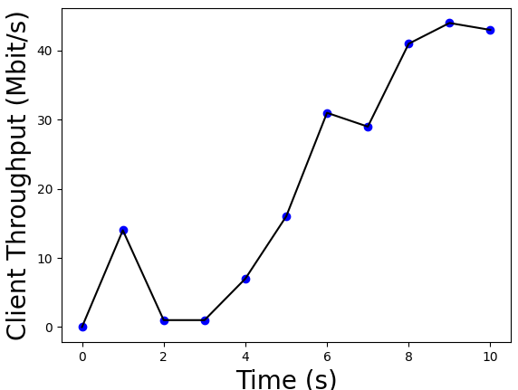 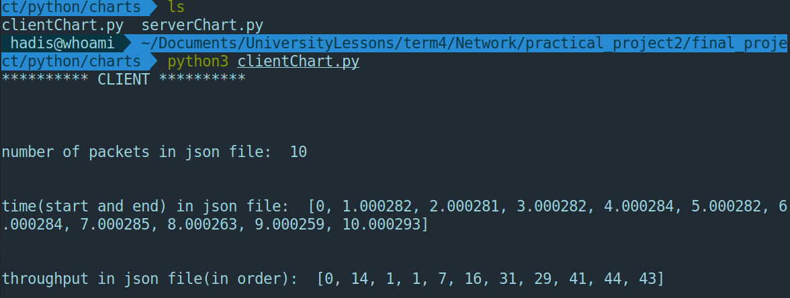
- Calculate Average Throughput
  - 

### UDP

- Doing all the steps declared in [HOW To Run the Program part](#how-to-run-the-program)
  - 
- Server Chart Info
  - 
    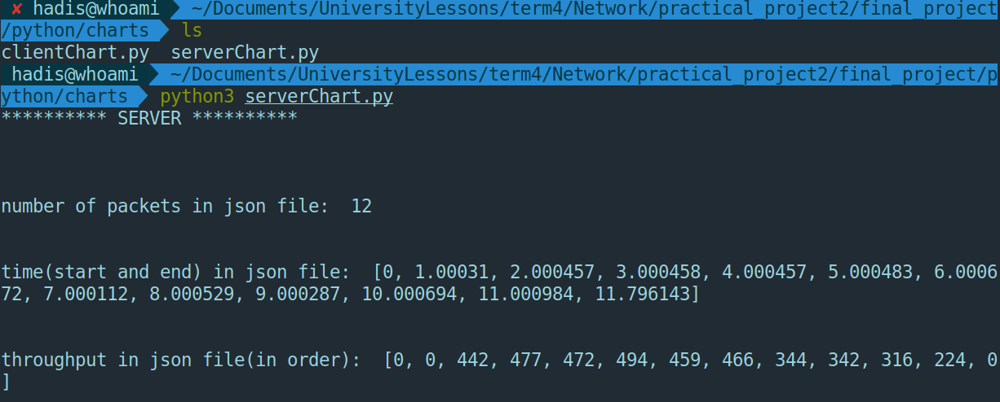
- Client Chart Info
  - 
    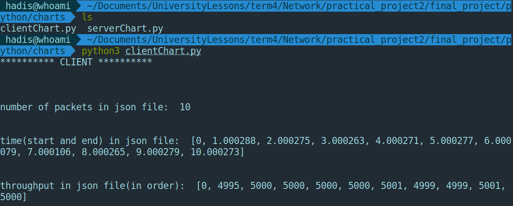
- Calculate Average Throughput
  - 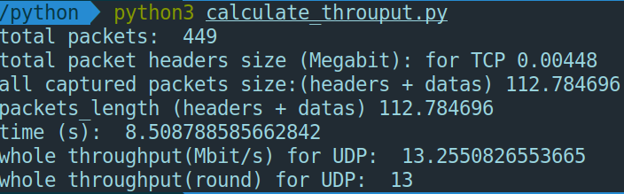

## **Channel with random delay**

### TCP

- Doing all the steps declared in [HOW To Run the Program part](#how-to-run-the-program)
  - 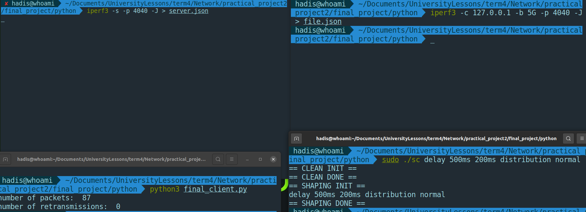
- Server Chart Info
  - 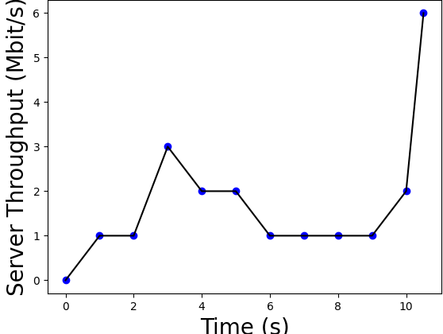
    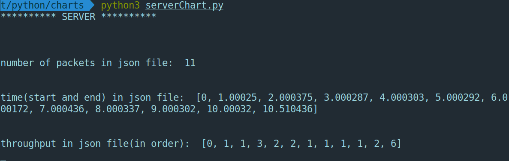
- Client Chart Info
  - 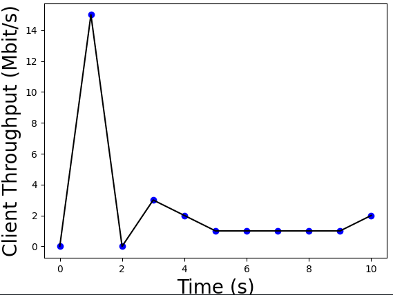
    
- Calculate Average Throughput
  - 

### UDP

- Doing all the steps declared in [HOW To Run the Program part](#how-to-run-the-program)
  - 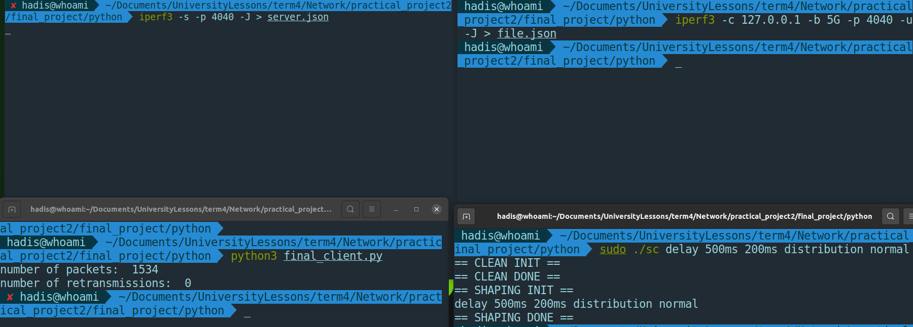
- Server Chart Info
  - 
    
- Client Chart Info
  - 
    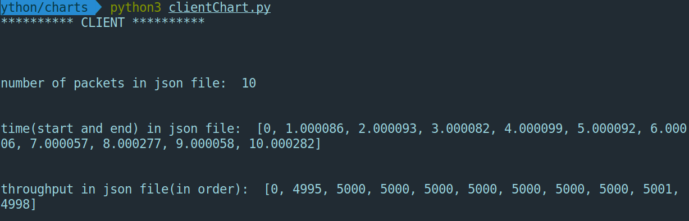
- Calculate Average Throughput
  - 

## **Channel with low loss**

### TCP

- Doing all the steps declared in [HOW To Run the Program part](#how-to-run-the-program)
  - 
- Server Chart Info
  - 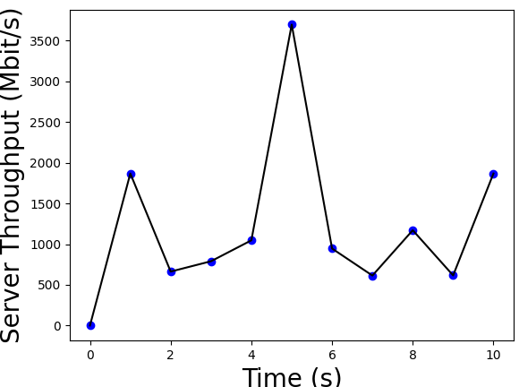
    
- Client Chart Info
  - 
    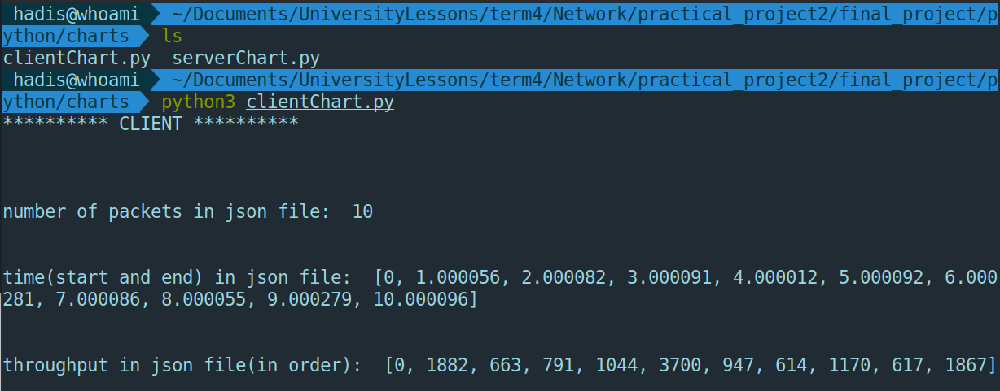
- Calculate Average Throughput
  - 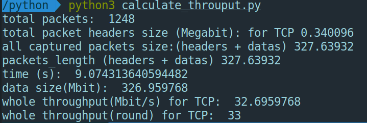

### UDP

- Doing all the steps declared in [HOW To Run the Program part](#how-to-run-the-program)
  - 
- Server Chart Info
  - 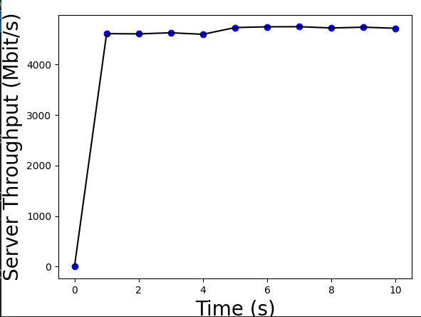
    
- Client Chart Info
  - 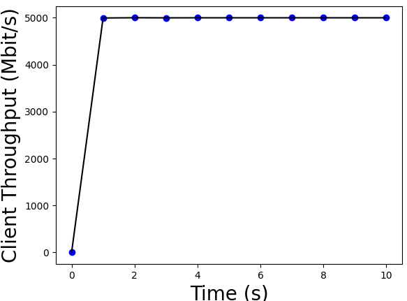
    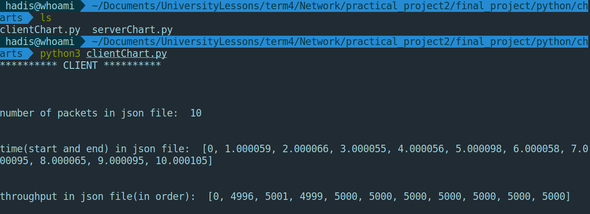
- Calculate Average Throughput
  - 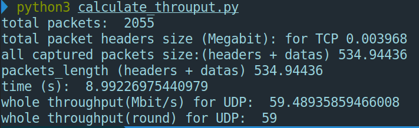

## **Channel with high loss**

### TCP

- Doing all the steps declared in [HOW To Run the Program part](#how-to-run-the-program)
  - 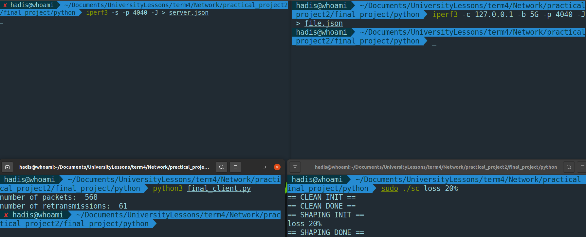
- Server Chart Info
  - 
- Client Chart Info
  - 
    
- Calculate Average Throughput
  - 

### UDP

- Doing all the steps declared in [HOW To Run the Program part](#how-to-run-the-program)
  - 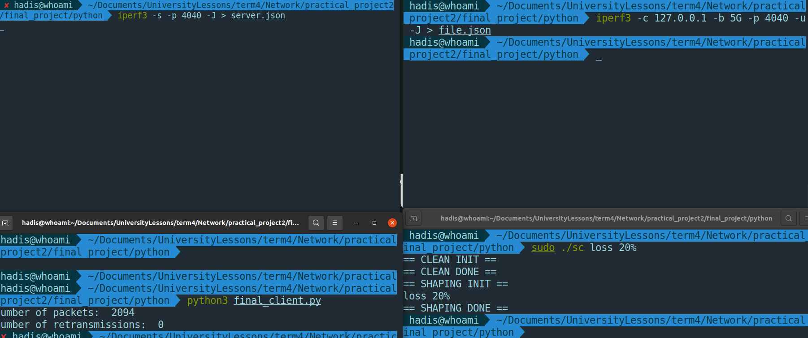
- Server Chart Info
  - 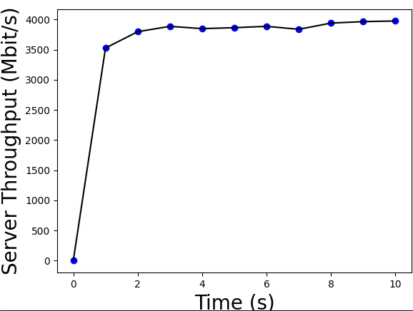
    
- Client Chart Info
  - 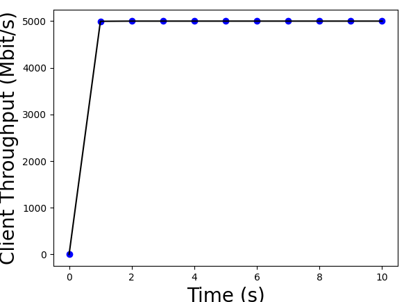
    
- Calculate Average Throughput
  - 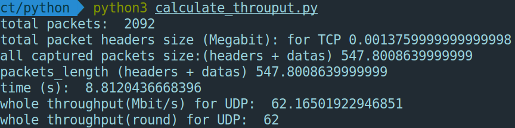

## **Ideal Channel**

### TCP

- Doing all the steps declared in [HOW To Run the Program part](#how-to-run-the-program)
  - 
- Server Chart Info
  - 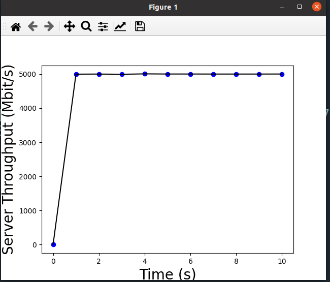
    
- Client Chart Info
  - 
    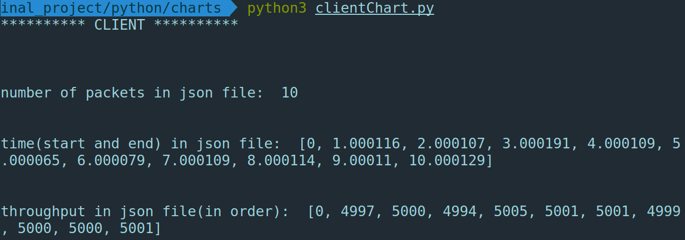
- Calculate Average Throughput
  - 

### UDP

- Doing all the steps declared in [HOW To Run the Program part](#how-to-run-the-program)
  - 
- Server Chart Info
  - 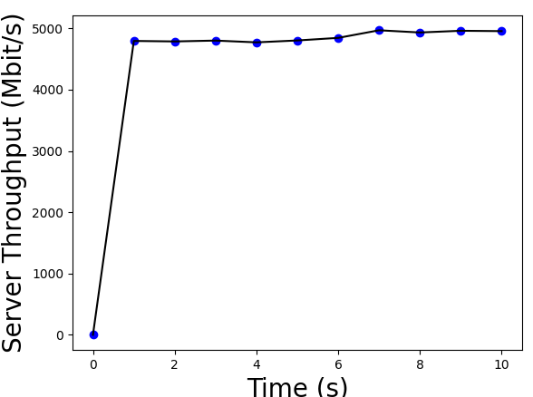
    
- Client Chart Info
  - 
    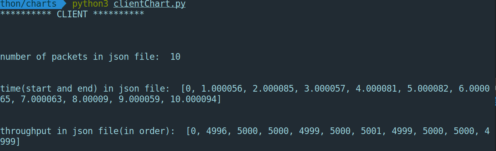
- Calculate Average Throughput
  - 

## References

- [markdown file](https://stackoverflow.com/questions/20303826/how-to-highlight-bash-shell-commands-in-markdown)

## License

- This project is licensed under [MIT License].
- You can use it for personal or educational purposes as long as you give credit to its author.

## Author

- This project was created by Hadis Ghafouri as second project of Computer Networks1 course at IUT.
- You can contact me by email at hadisghafouri98@gmail.com.
