## Forecasting The Power Produced By Solar Panels With The Help Of Data Mining Techniques

- 

## Abstract

- Solar energy is a promising source of renewable energy. Accurate forecasting of solar power generation has significant benefits for energy planning, grid management and investment decisions. 
- In this study, we study different machine learning approaches to predict the energy produced by solar panels for the next few days using a set of data from a solar power plant. 
- By comparing and evaluating different methods, we were able to achieve 98.9% accuracy with the help of **the random forest model**.

## 1.Introduction
- Solar energy is one of the best sources of renewable energy for many reasons, including availability and low environmental impact. However, forecasting solar energy production is challenging due to changes in weather conditions, panel efficiency, and other factors. 
- Accurate forecasts of solar power generation have significant benefits for energy planning, grid management, and investment decisions.
- In this study, we present different approaches of machine learning to predict the power produced by solar panels for the next few days, and by comparing these methods, we present **the best model** with the help of appropriate criteria for evaluation.
- The solar energy production dataset used in this study was obtained from [Kaggle](https://www.kaggle.com/datasets/anikannal/solar-power-generation-data). 
- This dataset contains **hourly data** of power generation and weather conditions for two solar power plants in India over a 34-day period.
- The dataset contains a total of 32,530 records.
- With the help of accurate forecasting of power generation in the coming days, we can make power grid management and electricity trade more efficient, have more flexibility in power grids and adapt to conditions, and minimize possible disruptions and problems.

## 2.Collected data
- The collected data set contains two CSV files, which contain data related to power generation and weather data for that day in the solar power plant.
- Each of the records in these files are recorded in 15-minute intervals.
- In fact, by merging these two sets of records, we will have records that each of them is related to an inverter in a 15-minute period that reports the following information.

### 1.Power Generation Data
- This file contains information about the amount of electricity produced by each inverter.
- The power plant consists of 22 inverters, each record corresponding to one inverter and in a 15-minute interval.

- 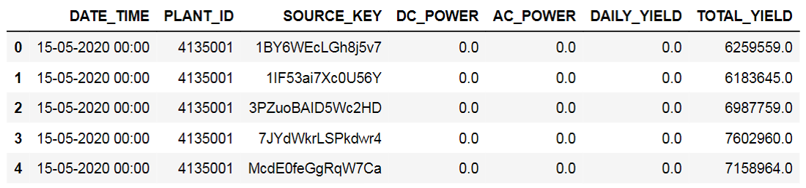
- DATE_TIME: Time of data registration
- SOURCE_KEY: ID of each inverter inside the power plant
- PLANT_ID: ID of the power plant
- DC_POWER: DC power produced by an inverter (kilowatts)
- AC_POWER: alternating current produced by an inverter (kilowatts)
- DAILY_YIELD: daily cumulative yield (kWh)
- TOTAL_YIELD: Cumulative sum of total yield (kWh)

### 2.Weather Data
- The first category is weather related information within 15 minutes in the entire power plant.
- In this file, information such as the amount of radiation and the temperature of the modules and the temperature of the environment are recorded.

- 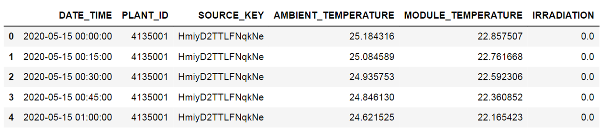
- DATE_TIME: Date and time for each observation
- SOURCE_KEY: ID of each sensor inside the power plant
- PLANT_ID: ID of the power plant
- AMBIENT_TEMPERATURE: ambient temperature (Celsius)
- MODULE_TEMPERATURE: Module temperature (Celsius)
- IRRADIATION: radiation for the 15 minute interval received by the solar panel (watts per square meter)

## 3.Experiments
### 3-1 Check correlation between features

- 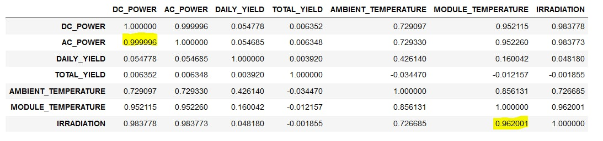
- As it is clear from the picture above, the correlation between the intensity of radiation and the temperature of the module is very high, and AC power and DC power also have a high correlation, that's why AC_POWER is chosen as the label.
- The correlation between radiation intensity and AC power is also high, which indicates a positive linear relationship between radiation intensity and AC power.

### 3-2 Identifying outlier Data
- We identified the outlier data with the help of Z-Score and IQR methods.
- We found that there are only **two outlier records** in the **IRRADIATION feature** of the two methods.
- The following image shows the boxplot diagram of this feature.
- 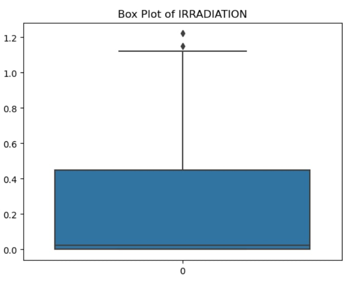
- 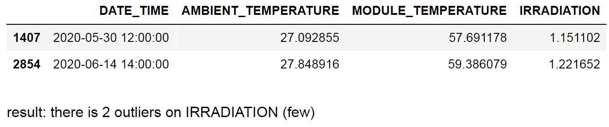

### 3-3 Record Making

- As mentioned, we plan to **predict the amount of AC_POWER produced for each day** based on the weather conditions, including the intensity of radiation and other features of the previous days.
- So we need to create new records according to our wishes and using dataset records.
- To predict the AC_POWER of each day, we used the features of the previous three days and acted in such a way that we found the data of four consecutive days using a window of four and considered the AC_POWER of the fourth day as a label.
- Also, we have each of the features of the previous days as a feature in the new record.
- For example, if we have two features for each record in the original dataset, the created record has six features that correspond to the features of three days before it.
- Now the window of four moves forward until it finally reaches the last day and the creation of records is finished.

## 4.Modeling
- At this stage, we divided the data into three sections:
1.Test
2.Train
3.Validation
- where 70% of the data is used for Train, 15% for Validation, and 15% for Test.

### 4-1 Data Normalization

#### 4-1-1 MinmaxScaler
- MinMaxScaler is a data normalization technique used in machine learning to scale numerical features within a specific range, usually between 0 and 1.
- This is done by first subtracting the minimum value of the attribute and then dividing it by the range (i.e. the difference between the maximum and minimum values).

- MinMaxScaler formula: X_scaled = (X - X_min) / (X_max - X_min)
- where X is the original feature value, X_min is the minimum feature value, X_max is the maximum feature value, and X_scaled is the scaled feature value.
- We use MinMaxScaler when we have features with different scales and want to bring them to the same scale.
- This is important because many machine learning algorithms are sensitive to the scale of the input data. 
- Data normalization can also help improve model performance and make it more robust.

#### 4-1-2 StandardScaler
- StandardScaler is a preprocessing technique in machine learning used to standardize data.
- This method transforms the data so that they have a mean of zero and a standard deviation of one.
- We use StandardScaler when we want to compare variables that have different units or scales. 
- In some machine learning models, features with larger values may dominate models with smaller values. 
- By standardizing data, we can give equal importance to all features.
- StandardScaler is commonly used in linear regression, logistic regression, and SVMs.
- StandardScaler formula: z = (x - u) / s
- where x is the original value of the feature, u is the mean of the feature, s is the standard deviation of the feature and z is the standardized value of the feature.

- 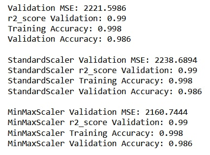

- As seen in the picture above, to choose between these two scalers, we used different error measurement criteria in regression problems.
- Due to the equality of the values obtained from criteria such as r2 score and accuracy between the two scale methods, we put the MSE error as the comparison criterion.
- According to the above results, the MSE error for the data scaled by the **MinMaxScaler method** is lower than the data standardized by the StandardScaler method. 
- So, in the continuation of our work, we will use the data that has been scaled with the help of this method.

### 4-2 Adding a new feature
- By examining the data further, we realized that there is a lot of correlation between the Total_Yeild features of the previous day, two days ago and three days ago.
- We know that if there is a correlation between two features, one of them should be removed. 
- Here we had two choices:
- first: to select the previous day's TOTAL_YEILD as features and delete the previous days' features.
- Second: we delete the Total_Yeild related to the previous three days and the new feature is the average of these three features related to the previous days.

- Using the data of both methods, we train the random forest model and predict the validation data with the help of these models.

- As can be seen in the picture below, the evaluation results obtained from the first method (the average features of the previous three days) are better and have a lower MSE than the second method, while the results obtained from other evaluation criteria are the same for both methods.

- 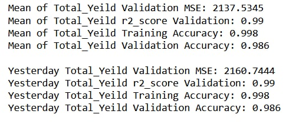

### 4-3 Pre-model
- In machine learning, **a dummy regressor** is a simple base model that serves as a reference point for evaluating the performance of more complex models.
- This model makes predictions based on simple rules that do not consider any of the characteristics of the input data.
- For this model, we first use **MinmaxScaler** to standardize the data according to the results of the previous parts.
- According to the results of section 2-4, we add the **average Total_Yeild feature** as a new feature.
- Finally, we divide the data into three parts, Test, Train, and Validation, and evaluate the model on Train and Validation data.

- The following figure shows the result of using dummy regressor with average strategy as Baseline for the data created with the above conditions.
- As it is clear, because this model has no training, the MSE error is extremely high and the R2 score shows zero.
- 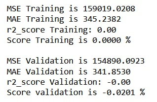

### 4-4 Modeling 
- At this stage, we are going to solve our regression problem with the help of the following algorithms.

#### 4-4-1 Linear Regression
- In the image below, the results of the evaluation of the Linear Regression model on the dataset data can be seen.
- These results are reported for the train and validation data.
- 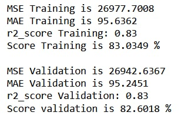

#### 4-4-2 Decision Tree
- In the image below, the results of the evaluation of the Decision Tree model on the dataset data can be seen.
- These results are reported for the train and validation data.
- 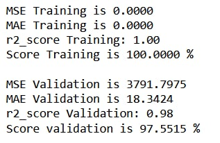

#### 4-4-3 Random Forest
- In the image below, we can see the results of evaluating the Random Forest model on the dataset data.
- These results are reported for train and validation data.
- 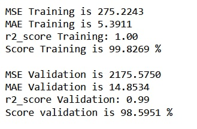

#### 4-4-5 Setting hyper parameters for the decision tree

- After training the decision tree model with default parameters, we saw that the model was **overfit** because we had a hundred percent R2 score for the most data.
- So it was necessary to adjust the hyperparameters in order to get better results on the validation data by preventing overfit.
- 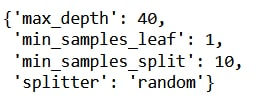 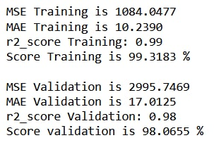

- After adjusting the hyperparameters, we trained the model and this time we got a lower R2 score for the most data, but the performance on the validation data was better than before and thus we got a more optimal model.

## 5. evaluation criteria

### 5-1 R2 score criteria
- R2 score is commonly used in machine learning to evaluate the performance of regression models.
- This measure, also known as the coefficient of determination, is a statistical measure that shows the proportion of variance in an output variable that can be explained by the input variable(s) in the regression model.
- In other words, it decides how well the line obtained from the linear regression model fits the real data.
- This value varies from 0 to 1, where 1 indicates perfect fit and 0 indicates no correlation between input and output variables.
- With the help of this criterion, we can determine whether the model is overfit or not and we can get insights about the accuracy of the predictions made by the presentation model.

- The formula for calculating R2 score is as follows:
    - R2 = 1 - (SSR / SST)
    - where SSR is equal to sum of squares of residuals (difference between predicted values and actual values)
    - SST is equal to total sum of squares (difference between actual values and average value).

- R2 score should be used when we want to understand the goodness of fit of a regression model.
- This measure is useful for comparing different regression models because it allows you to identify the model that best explains the variation in your data set.

### 5-2 Mean Square Error (MSE) criteria
- Mean squared error is a common criteria in machine learning to evaluate the quality of a regression model. 
- This criteria measures the average squared distance between the predicted values and the actual value of the target variable.
- The MSE of a model can be interpreted as the mean squared errors of the model in predicting the target variable.
- A smaller MSE indicates that the model performs better, as it means that the predictions are closer to the true values on average.
- MSE is widely used in regression tasks to evaluate the performance of different models.
- This measure is particularly useful when dealing with continuous variables, as it provides a quantitative measure of the accuracy of model predictions.
- However, it should be noted that **MSE gives the same weight to all errors** regardless of their magnitude, which may not always be desirable.
- The MSE formula is as follows: 
    - MSE = 1/n * Σ(y_i - y_hat_i)^2
    - n is the number of data points.
    - y_i is the actual target value of the ith data point.
    - y_hat_i is the predicted target value of the ith data point.
    - Σ represents the sum of the squared differences between the actual and predicted values.

### 5-3 Min Absolute Error (MAE) criteria

- In machine learning, the mean absolute error (MAE) is a measure commonly used to evaluate the performance of regression models. 
- MAE measures the mean absolute difference between predicted and actual values in a data set.

- The MAE calculation formula is as follows: 
    - MAE = (1/n) * ∑|y - ŷ|
    - where n is the number of samples in the data set
    - y is the actual value
    - ŷ is the predicted value.

- MAE is useful when we want to know how far our predictions are from the true values, but we don't necessarily care about the direction of the errors. 
- MAE is often used in conjunction with other metrics such as root mean square error (RMSE) to get a more complete picture of model performance.
- In general, MAE is a good choice when the number of outliers is small because it gives equal weight to all errors.

### 5-4 results of criteria evaluation
- The R2 score criterion for different models had close values and did not help us to choose the best model, but we paid attention to their MSE to compare the models. 
- **MSE shows the error difference of different models better** due to doubling the difference between the label and the predicted value.

## 6. Results

- In terms of R2 score, the Linear Regression model has a weaker performance than the Decision Tree and Random Forest models, and the MSE value of this model is also higher than the other two models.
- But it still performed better than Baseline. 
- The lack of data placement on a linear curve can be the reason for the weaker performance of this model compared to other models.

- Both of our Tree base models had close performance.
- R2 score criterion was similar for both.
- but Random forest performed better in terms of MSE criterion and was chosen as the final model. 
- Finally, we predicted the test data by the final model and achieved about **99% accuracy**.
- 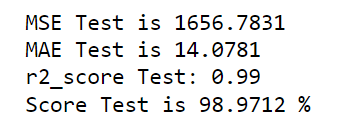