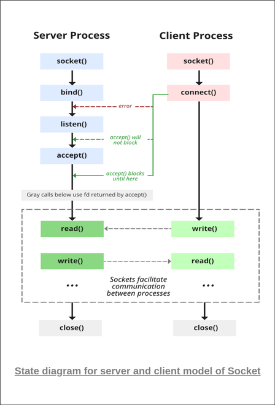
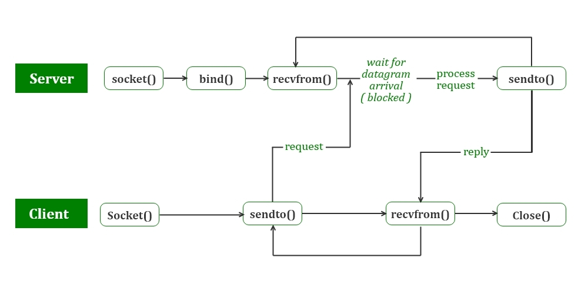

# Socket: an IPC mechanism

### What is Socket?
- In Linux, “socket” is a type of Inter-Process Communication (IPC) mechanism that allows processes to communicate with each other over a network or within a single system. 
- Sockets provide a common interface for sending and receiving data, regardless of the underlying communication protocol.
### Types of Sockets
- There are two types of sockets in Linux:

1. Local sockets (AF_UNIX or AF_LOCAL):
    - These sockets allow communication between processes running on the **same system**.
    - They use the file system as the communication medium, and the data is sent and received using file descriptor. 
    - Local sockets are also called UNIX domain sockets.

2. Network sockets (AF_INET or AF_INET6)
    - These sockets allow communication between processes running on different systems **over a network**.
    - They use the network protocol stack as the communication medium, and the data is sent and received using IP addresses and ports. 
    - Network sockets are also called Internet domain sockets.

### Socket Usage
Stream sockets: These sockets provide a reliable, two-way, connection-oriented communication channel. They are based on the Transmission Control Protocol (TCP) and are often used for applications such as file transfer, email, and web browsing.
Datagram sockets: These sockets provide a connectionless, unreliable communication channel. They are based on the User Datagram Protocol (UDP) and are often used for applications such as video streaming, online gaming, and telephony.
Raw sockets: These sockets allow direct access to the underlying communication protocols, and can be used for creating custom protocols or for low-level network troubleshooting.

### TCP Socket API
- 

### UDP Socket API
- 

- UDP Server
    - Create a UDP socket.
    - Bind the socket to the server address.
    - Wait until the datagram packet arrives from the client.
    - Process the datagram packet and send a reply to the client.
    - Go back to Step 3.

- UDP Client
    - Create a UDP socket.
    - Send a message to the server.
    - Wait until a response from the server is received.
    - Process the reply and go back to step 2, if necessary.
    - Close socket descriptor and exit.

## Reference
- [Socket IPC mechanism](https://takethenotes.com/socket/)
- [Socket Programming1](https://www.cs.dartmouth.edu/~campbell/cs60/socketprogramming.html)
- [Socket Programming2](https://www.geeksforgeeks.org/udp-server-client-implementation-c/)
- [Socket Programming3](https://www.geeksforgeeks.org/socket-programming-cc/)

